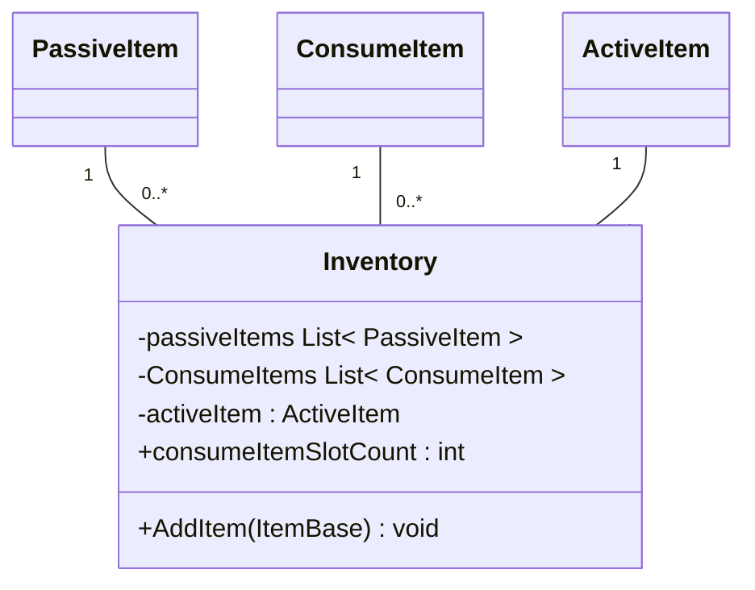
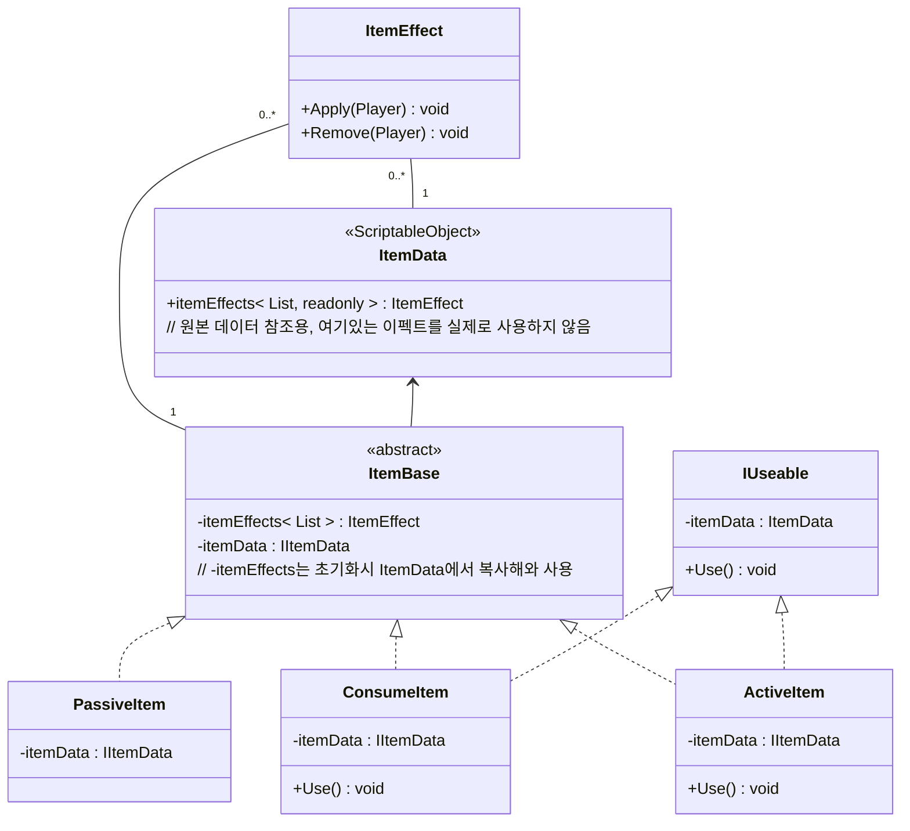
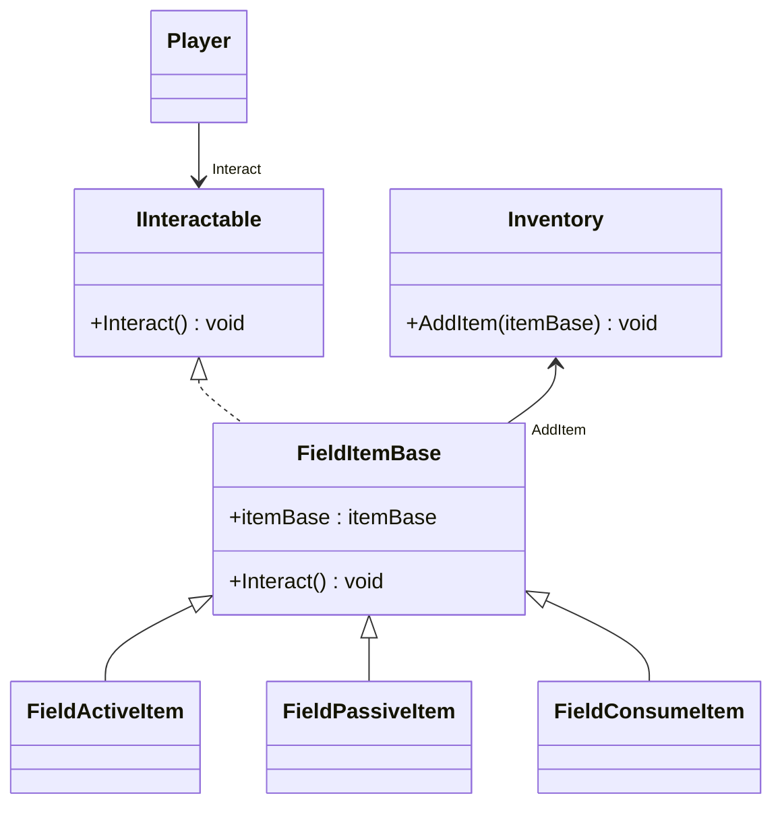

### 스펙 구상
* 인벤토리 스펙
    * 패시브 아이템
        * 무제한으로 넣을 수 있음, 여기있는 아이템을 플레이어가 직접 버리거나 할 순 없음
    * 소모 아이템
        * 2칸
        * 슬롯을 늘려주는 패시브 아이템이 존재한다
        * 슬롯들이 꽉 찬 상태에서 획득하려고 하면 획독할 수 없다는 메시지를 출력한다, 만약 강제로 지급되는 이벤트가 있다면 바닥에 뿌려진다
    * 액티브 아이템
        * 1칸
        * 액티브 아이템을 소지한 상태에서 획득하면 아이템이 교체된다

* 아이템들의 고유 특징
    * 패시브
        * 소지하면 지속적으로 효과가 부여된다
    * 액티브
        * 게임 중 사용버튼을 눌러 사용할 수 있
    * 소모
        * 게임 중 단축키를 눌러 사용할 수 있다

* 내부 자료구조
    * 인벤토리
        * 자료구조
            * 패시브 아이템 리스트
            * 소모 아이템 리스트
            * 액티브 아이템 (1개)
            * 아이템 색인이 필요해진다면 딕셔너리 추가
        * 함수
            * 패시브/액티브/소모 아이템 추가/삭제
            * 아이템 조회 : 소지 갯수 반환
            * 아이템 갯수 반환

## 다이어그램

### 인벤토리

### 인벤토리 아이템

### 필드 아이템 (드롭 아이템)
