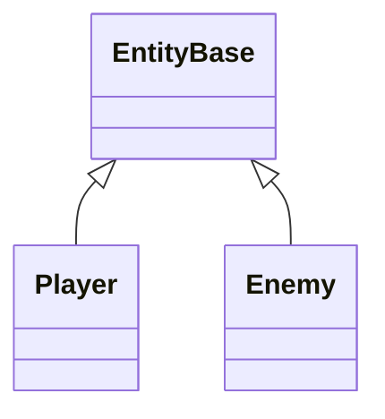
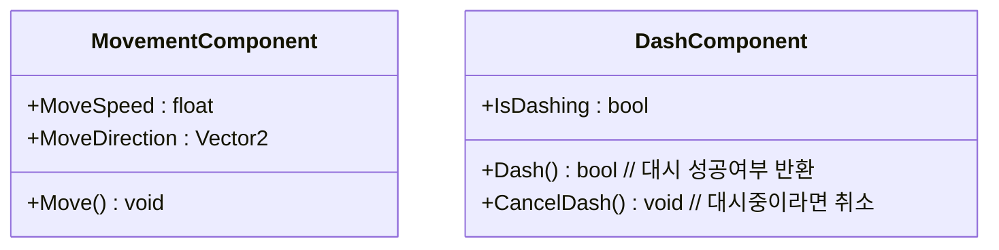
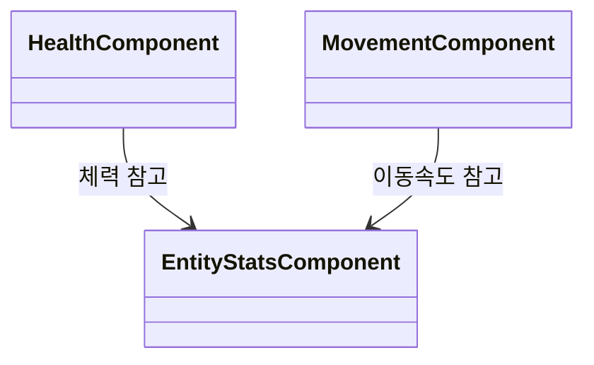
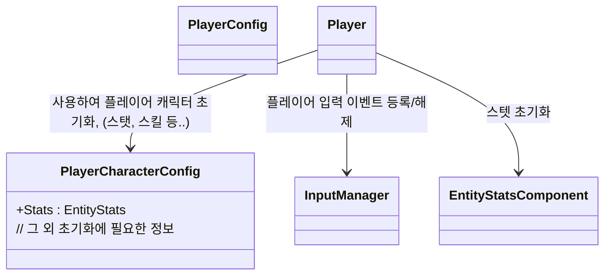

# 개요
플레이어, 적, 보물상자, NPC 등 게임 내의 Entity 개체들에 대한 설계 문서입니다.

---
## 클래스 다이어그램
### EntityBase - Entity의 중추 역할, 공통 기능 수행


### Entity 컴포넌트 함수/변수 명세



```mermaid
classDiagram
    class EntityStatsComponent{
        +Stats : EntityStats
        // 그 외 스탯 관련 연산이 있으면 사용
    }
    class HealthComponent{
        +TakeDamage() : void
        +Heal() : void
    }
    class CooldownComponent{
        +RegisterCooldown(string name, float time) : void
        +IsReady(string name) : bool
        +StartCooldown(string name) : void
        +GetCooldownPercent(string name) : float
    }
    class DeathComponent{
        +Death() void // 사망 연출 담당
    }
````
```mermaid
classDiagram
    class BehaviourTreeComponent{
        +SetBehaviourTree(BehaviourTreeNode bTNode) 
    }
```

### 컴포넌트 참조 관계 


### 플레이어 게임 오브젝트 클래스 관계도


---

# 임시작성

### 플레이어 오브젝트 초기화 관련 구상
* `PlayerCharacterConfig` 플레이어 오브젝트를 초기화하는데 필요한 데이터를 담는다, 플레이어가 선택한 캐릭터에 맞는 Config을 의존성 주입해 사용한다
  * 필요정보 생각해보기
    * 시작무기 정보
    * 소지아이템 정보
    * 스테이터스 정보
    * 소지금 정보

### 무기 관련 구상
* 무기 데이터가 담고 있어야 하는 정보들
  * 무기의 종류 (애니메이션, 공격 방식 결정 위해)
  * 스킬 정보 (무기 스킬)
  * 능력치 (공격력 등)

### 스킬 구상
* 공격스킬을 비롯한 특수한 행동을 스킬로 정의해 분류

## 필요한 기능 나열해보기
* 플레이어
    * 근처에 있는 '상호작용' 오브젝트를 감지하면 상호작용 UI이 띄워진다, 이때 상호작용 버튼을 누르면 상호작용 할 수 있다
    * 인벤토리에 있는 무기 아이템에 따라 다른 공격 방식과 공격 스킬을 사용할 수 있다
    * 이동할 수 있다
    * 구르기를 할 수 있다
    * 데미지를 입으면 사망한다
    * 여러가지 연산에 사용되는 스테이터스 수치를 지니고 있다
* 적
    * 플레이어의 공격에 데미지를 입을 수 있다
    * 자신이 속한 방에서 나갈 수 없다
    * 적에 따라 다른 행동 AI를 가질 수 있다
    * 적에 따라 다른 능력을 가질 수 있다
        * 이동
        * 마법
        * 공격
        * ...
* 보물상자
    * 상호작용 오브젝트로 플레이어가 다가와 상호작용하면 아이템을 준다
* NPC
    * 상호작용 오브젝트로 플레이어가 다가와 상호작용하면 대화 이벤트를 발생시킨다

## 러프한 설계
* `EntityBase` - Entity 공통 기능 정의, 혹여 공통 기능이 없더라도 Entity들의 공통 인터페이스 역할 수행
* `EntityComponent` - 기능 컴포넌트, 예를들면 이동 컴포넌트, 구르기 컴포넌트
    * 구체 `Entity` 클래스에 기능을 넣기보단 컴포넌트 기반으로 기능을 확장할 수 있도록 설계
        * 컴포넌트 예시
            * `EntityStatsComponent`
                * 스탯 관련 기능과 스탯 수치 접근 담당
                * EntityStats - 체력, 공격력 등 스탯 데이터
                    * 현재 상태를 저장하지는 않음, 예) 최대 체력값은 저장하지만 현재 체력값은 저장하지 않는다
            * `EntityBuffComponent`
                * 버프 및 상태이상 관리, 다른 컴포넌트에 영향을 줌
                    * 예) 최대체력 하락 디버프가 생기면 EntityStatsComponent의 최대 체력 수치를 줄이고 디버프가 사라지면 다시 복구한다
                        * 예) 체력회복 버프가 생기면 버프가 사라질때 까지 HealthComponent의 체력을 서서히 증가시킴
                      