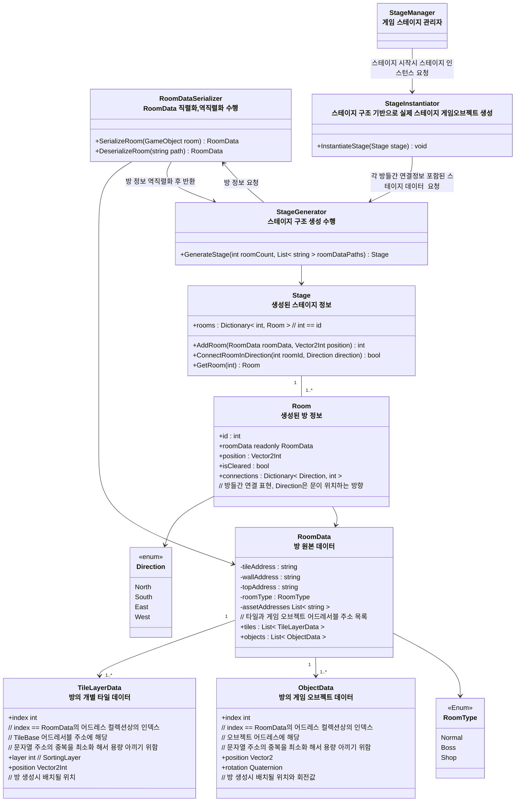
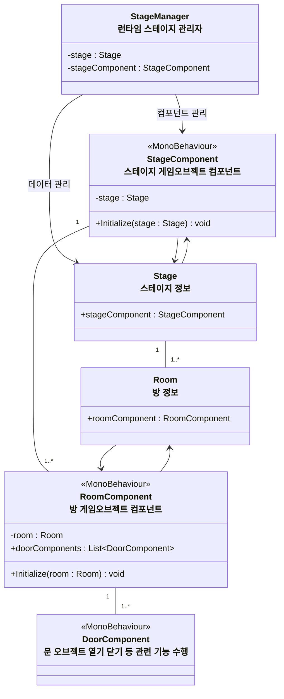
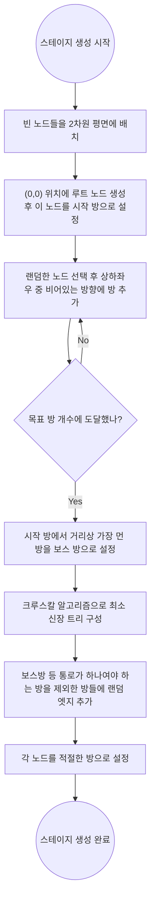
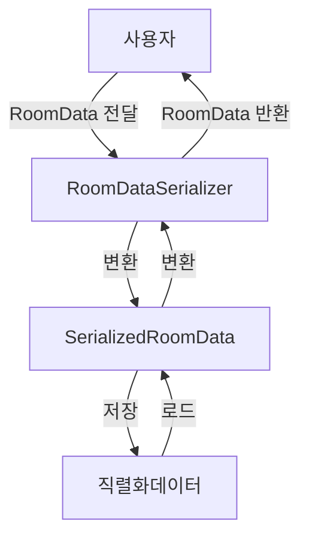
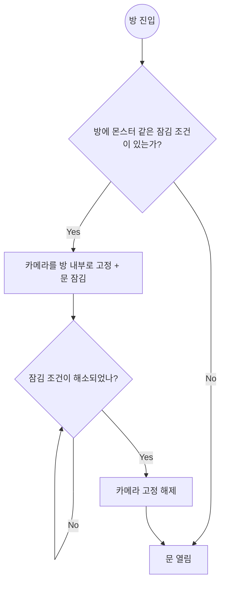

## 개요
스테이지와 방을 비롯한 게임 맵 자료구조,생성 알고리즘에 관한 설계

## 클래스 다이어그램
### 맵 생성 / 맵 데이터와 직렬화 관련 클래스 다이어그램


### 런타임 스테이지 관련 클래스 다이어그램



## 스테이지 생성 알고리즘

* 방 연결 로직: 그래프 기반 맵 생성
    1. 빈 노드들을 2차원 평면에 배치한다
        1. (0,0)위치에 루트 노드 생성, 이 노드를 시작 방으로 설정한다
        2. 랜덤한 노드를 선택한 후 해당 노드의 상,하,좌,우 방향 중 랜덤한 비어있는 방향에 방을 추가한다
        3. 목표한 방 갯수에 도달할 때 까지 2번을 반복한다
        4. 방을 모두 만들었다면 시작방에서 거리상 가장 먼 방을 보스방으로 설정한다 (추후 상점 등 다른 특수방이 추가된다면 이 단계에서 배치한다)
    2. 방들이 끊어지지 않고 신장 트리 형태를 갖추도록 시작 방 부터 시작해 랜덤한 방끼리 연결한다
        * BFS 탐색을 통해 연결한다
            * (원래 추후 연결 가중치를 염두에 두고 크루스칼 알고리즘과 Union-Find를 사용하려 했으나 너무 오버 스펙인듯 하여 사용하지 않으려 함)
    3. 랜덤한 방향으로 엣지들을 추가한다
        * 단 보스방처럼 특별한 방들엔 엣지를 추가하지 않는다 (진입로를 하나로 유지하기 위함)

## 방 데이터 프리셋 편집 및 저장

`RoomData` 직렬화/역직렬화 흐름도


* `RoomDataSerializer` 를 사용, 에디터를 통해 배치한 타일맵과 오브젝트들을 `RoomData`로 직렬화

방 데이터 프리셋 제작시 계층구조
``` 

- RootGameObject
    - Tilemaps
        - 레이어별 타일맵 컴포넌트들..
    - Objects
        - 게임 오브젝트들 (적, 보물상자등..) 
```

## 런타임 중 스테이지 생성
* `StageGenerator`가 스테이지 생성 관련 세부 로직을 담당한다
* `RoomDataSerializer`를 통해 역직렬화된 `RoomData`를 가져와 `Room`을 생성한다
* 정해진 로직에 따라 각 방을 이어붙여 `Stage`를 생성한다
* `StageInstantaitor`가 스테이지 인스턴스 생성 로직을 담당한다
    * 방 사이즈는 `RoomConstants`에 지정된 방 사이즈를 기반으로 생성되며 마찬가지로 지정된 간격만큼 서로 간격을 유지하여 배치된다
    * 연결된 방이 있는 방향에는 벽을 생성하지 않고 타일을 배치하여(복도) 방들간 이동 가능하도록 만든다


### 방 데이터 프리셋 저장 용량 최적화
* 다음과 같은 방식으로 저장시 용량을 최적화한다
* 타일셋과 오브젝트의 종류를 표현할때 인덱스 방식으로 표현
    * 예) 오브젝트나 타일셋의 어드레서블 주소를 표현할 때 "Enemy001" 같은 방식이 아닌 타일,오브젝트 주소 배열을 따로 만든후 배열에 해당하는 숫자 인덱스로 저장
* RLE 알고리즘을 통해 연속되는 타일 용량 최적화

현재 위 방식으로 프로토타입 맵을 대상으로 직렬화 해 본 결과 5.9Mb -> 89kb로 용량 감소

## 방 에디터 스크립트 `RoomEditor`

아래 기능을 포함한다, 게임을 실행하지 않은 상태에서 동작해야 한다
인스펙터 버튼은 오딘 인스펙터 에셋을 사용해 만든다
* 컴포넌트 활성화시
    * 해당 컴포넌트 하위에 Tilemaps(Grid 컴포넌트 부착)와 Objects 게임오브젝트가 있는지 확인하고 없다면 생성한다
* 인스펙터 버튼
    * 맵 저장(직렬화) 버튼
        * 지정한 경로에 맵을 저장한다
    * 맵 불러오기(역직렬화) 버튼
        * 지정한 Json 파일에서 맵 데이터를 읽어와 배치한다, 기존에 배치된 게임오브젝트와 타일들은 사라진다

## 스테이지와 방
방 진입 -> 클리어 흐름도

* `Room`에 진입
    * `Room` 내에 잠금 조건이 존재한다면 모든 문이 닫힌다
        * 문이 잠겼다면 카메라 범위를 방 안으로 제한한다, (카메라가 방 밖으로 빠져나가지 않도록 한다), 만약 카메라보다 방이 작거나 같다면 카메라의 위치는 방의 중앙 지점으로 고정된다
* `Room` 클리어
    * 잠금 조건을 모두 해결하였다면 (적 모두 제거, 스위치 누르기 등) 방을 클리어 한 것으로 처리하고 방문이 열린다

## 런타임 스테이지 인스턴스 구조

스테이지와 방의 데이터 구조`Stage`, `Room`와 실제 게임오브젝트에 사용되는 `Monobehaviour` 컴포넌트`StageComponent`, `RoomComponent`로 구성된다

### 컴포넌트
* 컴포넌트들간엔 연결구조 X, 탐색은 오로지 데이터 구조(`Stage`, `Room`)로 수행
* **StageComponent**
    * 스테이지 게임오브젝트에 붙는 컴포넌트
    * `AddressablesScope`를 보유하여 필요한 리소스 관리
* **RoomComponent**
    * 각 방 게임오브젝트에 붙는 컴포넌트
    * `AddressablesScope`를 보유하여 필요한 리소스 관리
* **StageManager**
    * 런타임 `Stage`, `Room` 관리자
    * 스테이지 흐름, 관리 전반 담당


## 임시 작성
- 시드 기능? 같은 시드를 넣으면 언제나 같은 결과물이 나오도록 하기