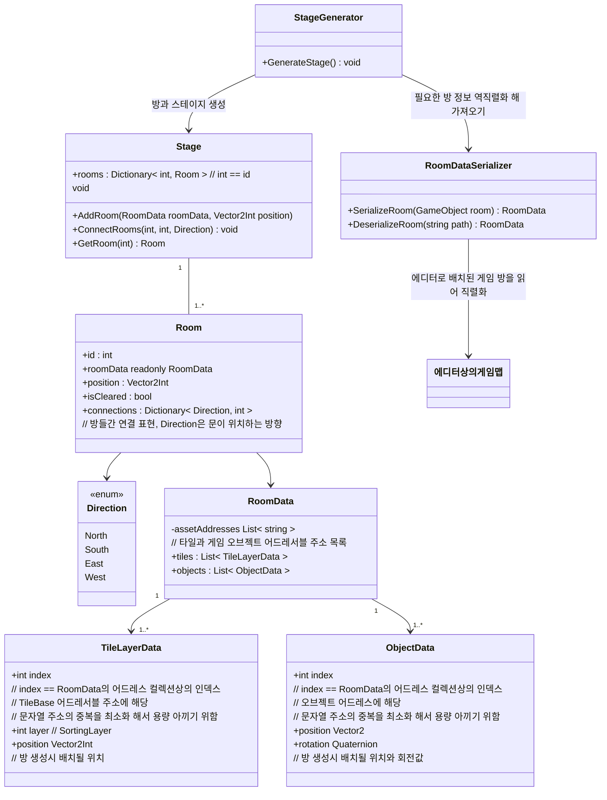
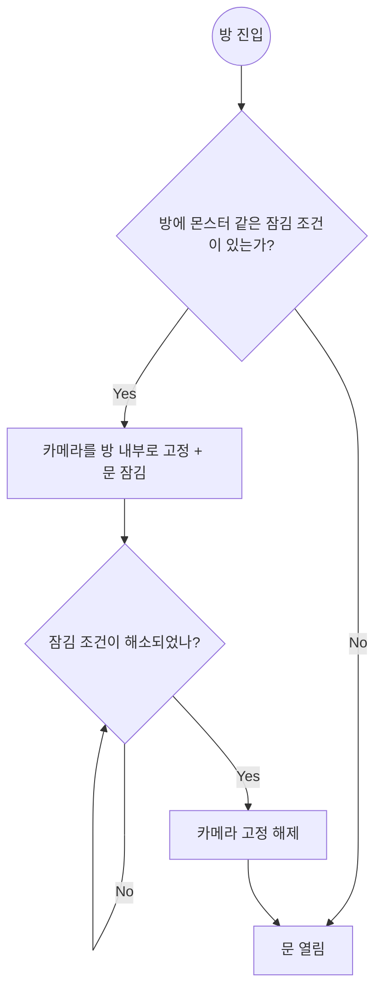

# 스펙

## 스테이지와 방
* `Stage` 하나에 여러가지 `Room`을 랜덤하게 이어붙여 스테이지를 만들어 낸다
    * `Room`간의 연결은 방을 노드, 문을 엣지로 사용하는 그래프를 사용해 표현한다
* `Room`에 진입
    * `Room` 내에 잠금 조건이 존재한다면 모든 문이 닫힌다
        * 문이 잠겼다면 카메라 범위를 방 안으로 제한한다, (카메라가 방 밖으로 빠져나가지 않도록 한다), 만약 카메라보다 방이 작거나 같다면 카메라의 위치는 방의 중앙 지점으로 고정된다
* `Room` 클리어
    * 잠금 조건을 모두 해결하였다면 (적 모두 제거, 스위치 누르기 등) 방을 클리어 한 것으로 처리하고 방문이 열린다

### 방 데이터 프리셋 편집 및 저장
* `RoomDataSerializer` 를 사용, 에디터를 통해 배치한 타일맵과 오브젝트들을 `RoomData`로 직렬화
* 방 데이터 프리셋 제작시 계층구조
    * RootGameObject
        * Tilemaps
            * 타일맵 컴포넌트들..(레이어에 따라 별도의 게임오브젝트로 분리됨)
        * Objects
            * 게임 오브젝트들 (플레이어, 적, 보물상자 등..) 
### 런타임 중 스테이지 생성
* `StageGenerator`가 스테이지 생성 관련 세부 로직을 담당한다
* `RoomDataSerializer`를 통해 역직렬화된 `RoomData`를 가져와 `Room`을 생성한다
* 정해진 로직에 따라 각 방을 이어붙여 `Stage`를 생성한다

## 다이어그램

### 클래스 다이어그램

스테이지와 방

### 플로우차트
방 진입 -> 클리어 흐름도
