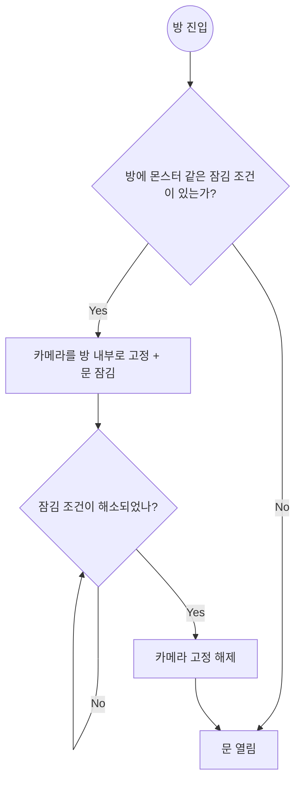
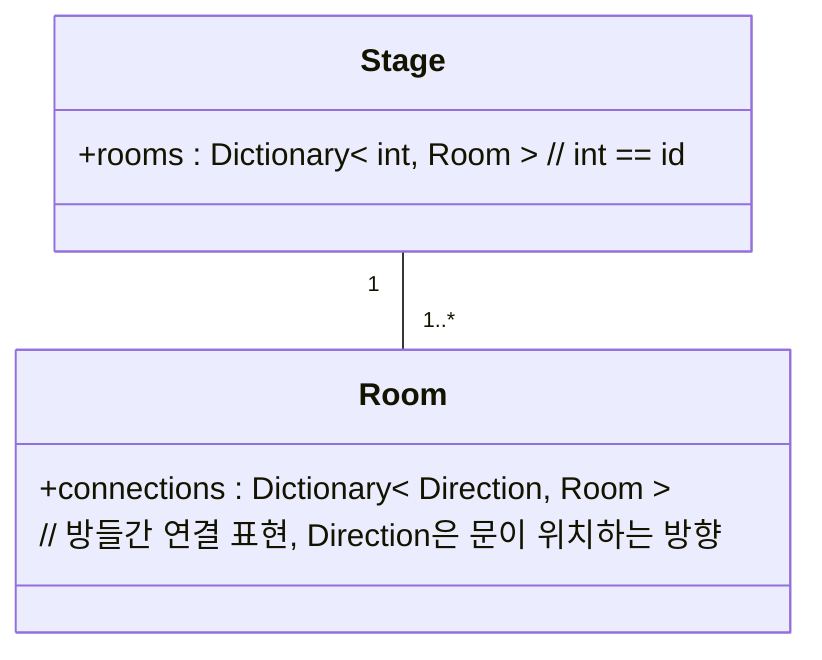

# 스펙

## 방
* `Stage`는 여러가지 `Room`이 모여서 만들어진다
    * `Room`간의 연결은 방을 노드, 문을 엣지로 사용하는 그래프를 사용해 표현한다
* `Room`에 진입
    * `Room` 내에 잠금 조건이 존재한다면 모든 문이 닫힌다
        * 문이 잠겼다면 카메라 범위를 방 안으로 제한한다, (카메라가 방 밖으로 빠져나가지 않도록 한다), 만약 카메라보다 방이 작거나 같다면 카메라의 위치는 방의 중앙 지점으로 고정된다
* `Room` 클리어
    * 잠금 조건을 모두 해결하였다면 (적 모두 제거, 스위치 누르기 등) 방을 클리어 한 것으로 처리하고 방문이 열린다

## 다이어그램

### 방 진입 -> 클리어 흐름도

### 클래스 다이어그램

