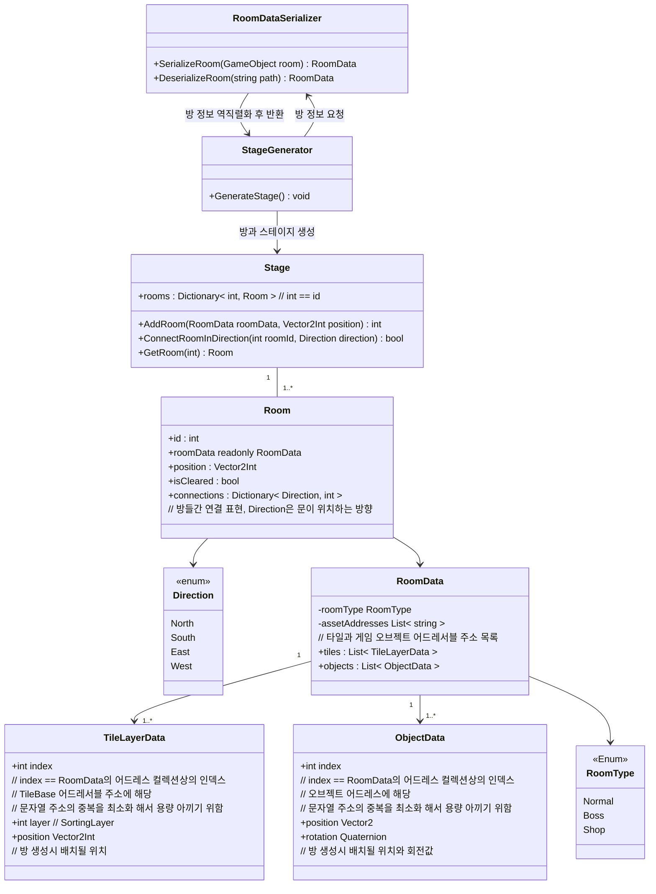
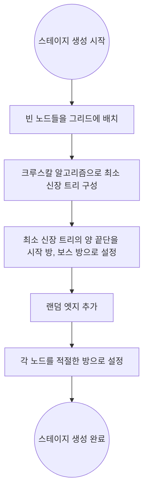

## 개요
스테이지와 방을 비롯한 게임 맵 자료구조,생성 알고리즘에 관한 설계

## 클래스 다이어그램

스테이지와 방


## 스테이지 생성 알고리즘

* 방 연결 로직: 그래프 기반 맵 생성
    1. 빈 노드들을 생성한다
    2. 방들이 끊어지지 않고 최소 신장 트리형태를 갖추도록 시작 방 부터 시작해 랜덤한 방끼리 연결한다
        * 크루스칼 알고리즘을 사용한다
        * 모든 방이 연결된 후 양 끝단의 방들 중 하나를 플레이어가 처음 스폰되는 방, 하나를 보스 방으로 설정한다
    3. 자연스러워 보이도록 랜덤한 엣지들을 추가한다
        * 엣지의 갯수는 랜덤으로 하되 시작지점에서 먼 방일수록 연결된 엣지가 적어질 가능성이 높아지도록 한다
    4. 각 방을 채운다
        * 단, 보스방 등 플레이어가 스테이지 시작 즉시 접근하면 곤란한 방들은 가급적 시작 지점과 떨어진 부분에 배치하도록 하여 플레이어가 특수방에 바로 방문하는걸 방지한다
* 방 형태
    * 문 생성위치 제약이 없는 방 : 문이 하나만 있을수도 있고 네개 모두 있을 수 있는 방
    * 문이 한쪽으로 밖에 없는 방 : 통로가 동,서,남,북 중 한쪽만 있을 수 있는 방
* 스테이지 번호에 따라 달라지는 데이터들
    * 스테이지 번호에 따라..
        * 방과 방을 잇는 통로를 어떤 타일과 벽으로 장식할지 정보
        * 어떤 랜덤한 적과 아이템이 등장할지 정보

## 방 데이터 프리셋 편집 및 저장

`RoomData` 직렬화/역직렬화 흐름도


* `RoomDataSerializer` 를 사용, 에디터를 통해 배치한 타일맵과 오브젝트들을 `RoomData`로 직렬화

방 데이터 프리셋 제작시 계층구조
``` 

- RootGameObject
    - Tilemaps
        - 레이어별 타일맵 컴포넌트들..
    - Objects
        - 게임 오브젝트들 (적, 보물상자등..) 
```

### 런타임 중 스테이지 생성
* `StageGenerator`가 스테이지 생성 관련 세부 로직을 담당한다
* `RoomDataSerializer`를 통해 역직렬화된 `RoomData`를 가져와 `Room`을 생성한다
* 정해진 로직에 따라 각 방을 이어붙여 `Stage`를 생성한다

### 방 데이터 프리셋 저장 용량 최적화
* 다음과 같은 방식으로 저장시 용량을 최적화한다
* 타일셋과 오브젝트의 종류를 표현할때 인덱스 방식으로 표현
    * 예) 오브젝트나 타일셋의 어드레서블 주소를 표현할 때 "Enemy001" 같은 방식이 아닌 타일,오브젝트 주소 배열을 따로 만든후 배열에 해당하는 숫자 인덱스로 저장
* RLE 알고리즘을 통해 연속되는 타일 용량 최적화

현재 위 방식으로 프로토타입 맵을 대상으로 직렬화 해 본 결과 5.9Mb -> 89kb로 용량 감소

## 스테이지와 방
방 진입 -> 클리어 흐름도

* `Room`에 진입
    * `Room` 내에 잠금 조건이 존재한다면 모든 문이 닫힌다
        * 문이 잠겼다면 카메라 범위를 방 안으로 제한한다, (카메라가 방 밖으로 빠져나가지 않도록 한다), 만약 카메라보다 방이 작거나 같다면 카메라의 위치는 방의 중앙 지점으로 고정된다
* `Room` 클리어
    * 잠금 조건을 모두 해결하였다면 (적 모두 제거, 스위치 누르기 등) 방을 클리어 한 것으로 처리하고 방문이 열린다