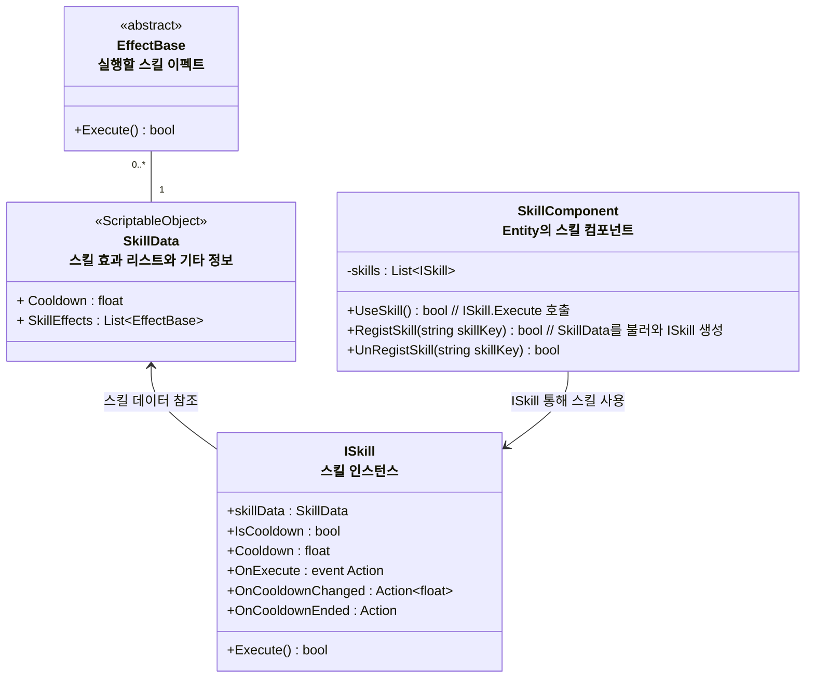
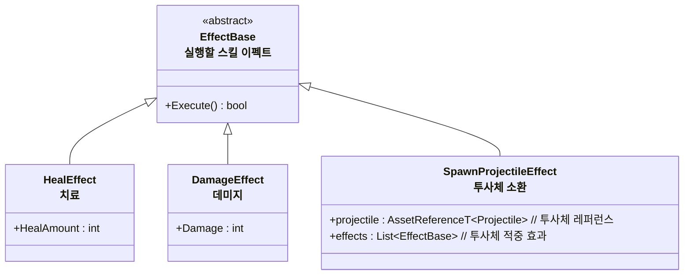

# 개요
> Entity가 사용하는 스킬 시스템 전반에 대한 설계 문서입니다.

---

## 스킬 시스템 구조

- SkillData 스크립터블 오브젝트를 통해 스킬 효과를 작성한다
- 사용자는 Skill 인스턴스를 통해 실제로 스킬을 사용한다
### 스킬 이펙트들

---

# 임시 작성

- `ISkillData` -> 스킬에 대한 데이터, 데이터는 기본적으로 불변
  - 프로퍼티
    - `List<ISkillEffect>`  
    - 쿨타임 정보
- `ISKill` -> 스킬 정보 및 데이터
  - 프로퍼티
    - 스킬 쿨타임 찼을때 이벤트
    - 스킬 사용시 이벤트
    - `ISkillData`
    - 현재 쿨타임
  - 함수
    - 비동기 함수로 내부 쿨타임 업데이트
    - 스킬 발동 (ISkillData 콜렉션을 돌면서 실행)

- `ISkillEffect` 스킬 이펙트
  - HealEffect 
    - 회복수치
  - DamageEffect
    - 데미지 수치
  - SpawnProjectile
    - 투사체 에셋 레퍼런스
    - 충돌시 적용할 스킬 이펙트 리스트
    - 충돌 가능 시작시간
    - 충돌 가능 종료시간
    - 오브젝트 유지시간
    - 전진시간
    - 전진속도
    - 충돌시 소멸 여부
    - 아군에게 적용 여부
    - 적에게 적용 여부
  - SpawnAreaEffect
    - 장판 에셋 레퍼런스
    - 충돌시 적용할 스킬 이펙트 리스트
    - 유지시간
    - 충돌시 소멸 여부
    - 아군에게 적용 여부
    - 적에게 적용 여부
- Projectile 투사체 오브젝트, 아마 대부분 스킬에 사용하게 될 것
  - 충돌시 적용할 스킬 이펙트 리스트
  - 소유자(투사체 생성한 Entity)
  - 유지시간
  - 전진시간
  - 충돌시 소멸 여부