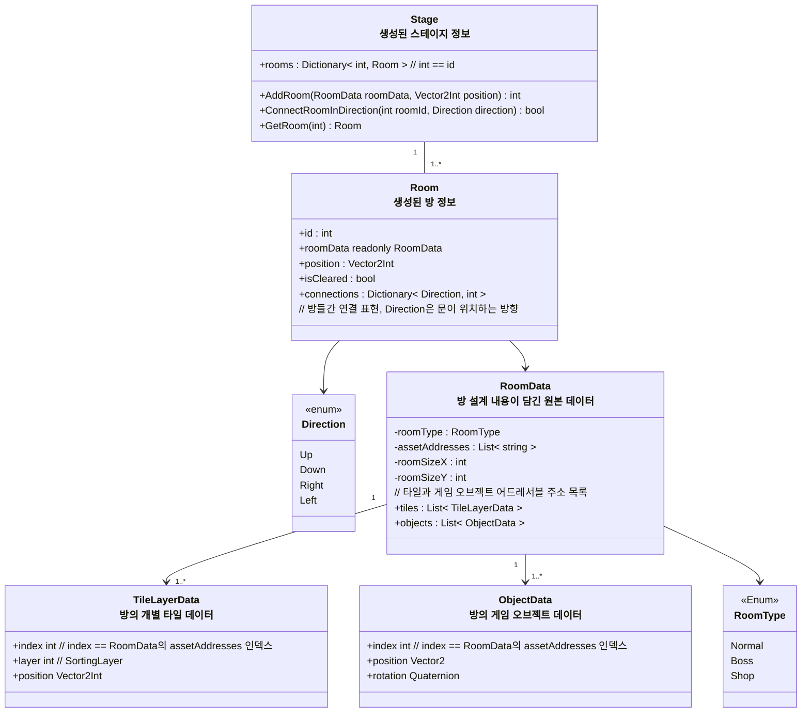
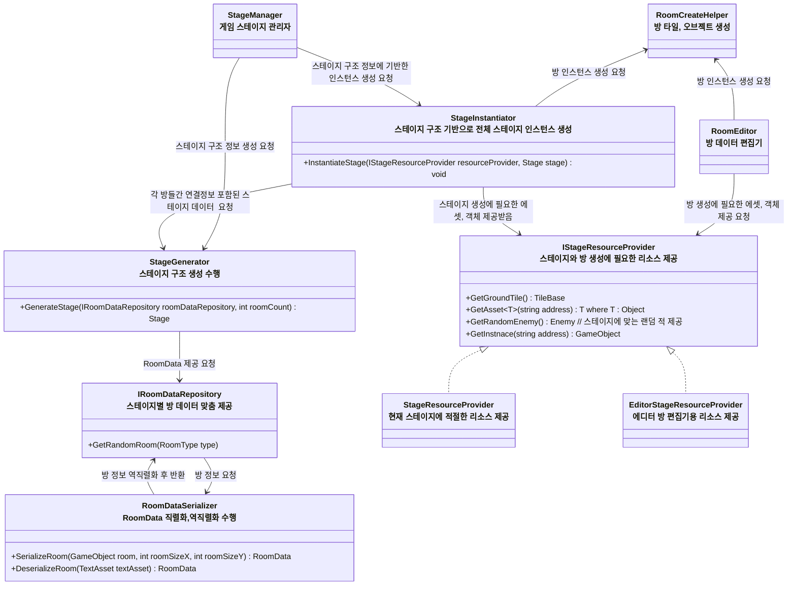
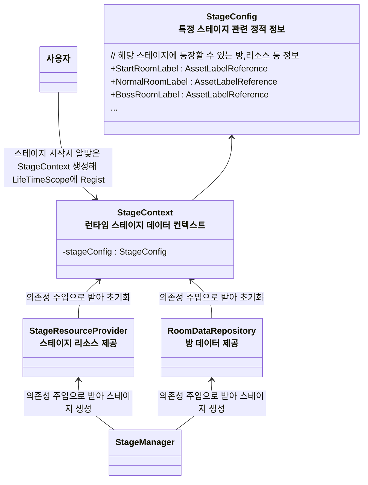
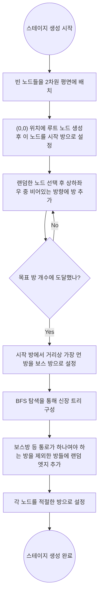
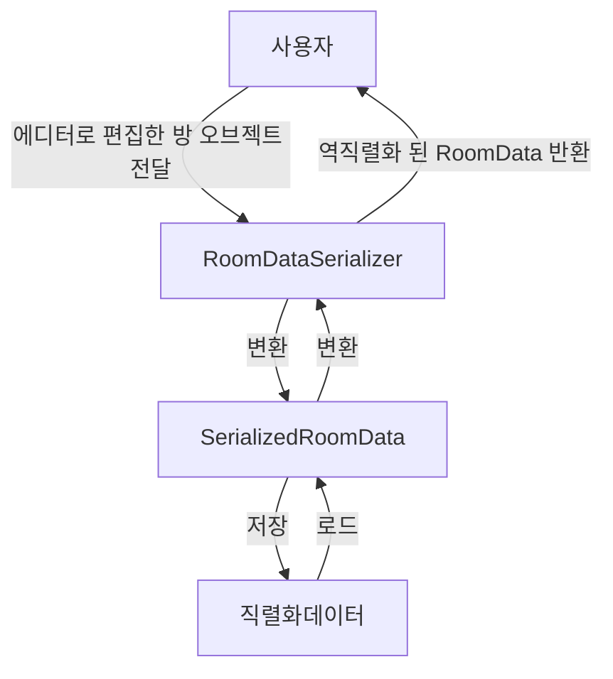

## 개요
> 스테이지와 방을 비롯한 게임 맵 자료구조,생성 알고리즘에 관한 설계

### 기본 개념
- 여러 방들을 이어붙여 무작위 랜덤생성 던전을 만든다
- `Room`과 `Room`들간의 연결구조를 `Stage`로 관리한다
- 각 Room의 구성은 에디터에서 미리 프리셋 형태로 편집하고 `RoomData`라는 형태로 직렬화 저장
- 런타임에 `RoomData`를 불러와 일련의 규칙에 따라 `Room`들을 생성하고 이어붙여 던전을 생성한다

## 클래스 다이어그램

### 방과 스테이지 구조 클래스 다이어그램


### 스테이지와 방 생성 관련 구조 클래스 다이어그램

### RoomDataRepository, StageResourceProvider 초기화 방식


---
# 스테이지와 방 생성
## 스테이지 생성 알고리즘

1. 빈 노드들을 2차원 평면에 배치한다
    1. (0,0)위치에 루트 노드 생성, 이 노드를 시작 방으로 설정한다
    2. 랜덤한 노드를 선택한 후 해당 노드의 상,하,좌,우 방향 중 랜덤한 비어있는 방향에 방을 추가한다
    3. 목표한 방 갯수에 도달할 때 까지 2번을 반복한다
    4. 방을 모두 만들었다면 시작방에서 거리상 가장 먼 방을 보스방으로 설정한다 (추후 상점 등 다른 특수방이 추가된다면 이 단계에서 배치한다)
2. 방들이 끊어지지 않고 신장 트리 형태를 갖추도록 시작 방 부터 시작해 랜덤한 방끼리 연결한다
    * BFS 탐색을 통해 연결
3. 랜덤한 방향으로 엣지들을 추가한다
    * 단 보스방처럼 특별한 방들엔 엣지를 추가하지 않는다 (진입로를 하나로 유지하기 위함)
4. 이후 `StageInstantaitor`에게 생성된 방 데이터를 넘겨 스테이지를 인스턴스화한다

## 방 데이터 프리셋 편집 및 저장 구조

`RoomData` 직렬화/역직렬화 흐름도

* `RoomData` -> 런타임에 사용하기 위한 Raw 방 데이터
* `SerializedRoomData` -> 직렬화시 용량 최적화 로직이 적용되어있는 저장용 데이터

## 스테이지 게임오브젝트 계층 구조
``` 
- Stage
    - Tilemaps : 특정 방에 속하지 않는 것들
        - Tilemap_Ground : 방 크기에 기반하여 자동 생성되는 기본 지형 타일
        - Tilemap_Deco : 맵 제작시 직접 배치한 장식타일
    - Objects : 게임 오브젝트들
```


## 방 데이터 프리셋 저장 용량 최적화
* 다음과 같은 방식으로 저장시 용량을 최적화한다
* 타일셋과 오브젝트의 종류를 표현할때 인덱스 방식으로 표현
    * 예) 오브젝트나 타일셋의 어드레서블 주소를 표현할 때 "Enemy001" 같은 방식이 아닌 타일,오브젝트 주소 배열을 따로 만든후 배열에 해당하는 숫자 인덱스로 저장
* RLE 알고리즘을 통해 연속되는 타일 용량 최적화

## 방 에디터 스크립트 `RoomEditor`
아래 기능을 포함한다, 게임을 실행하지 않은 상태에서 동작해야 한다
* 컴포넌트 활성화시
    * 해당 컴포넌트 하위에 Tilemaps(Grid 컴포넌트 부착)와 Objects 게임오브젝트가 있는지 확인하고 없다면 생성한다
* 인스펙터 버튼
    * 맵 저장(직렬화) 버튼
        * 지정한 경로에 맵을 저장한다
    * 맵 불러오기(역직렬화) 버튼
        * 지정한 Json 파일에서 맵 데이터를 읽어와 배치한다, 기존에 배치된 게임오브젝트와 타일들은 사라진다
    * 맵 초기화 버튼
        * 아무것도 생성하지 않은 상태로 초기화