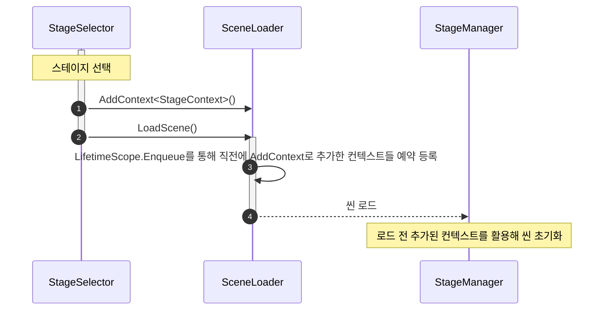

### SceneLoader
* 단일 씬 이동 관리자가 아님, 씬을 한번 로드할때 사용하는 일회성 객체
* 함수
    * LoadScene(string sceneName) 씬을 로드한다
    * AddContext<T>(T context) 로드할 씬의 LifeTimeScope에 반영할 Context를 추가한다

### SceneLoader 활용한 스테이지 선택창을 통한 스테이지 씬 이동 예시 시퀀스 다이어그램

---
## 참고문서
### VContainer 문서 : Generate child scope via scene or prefab
https://vcontainer.hadashikick.jp/scoping/generate-child-via-scene