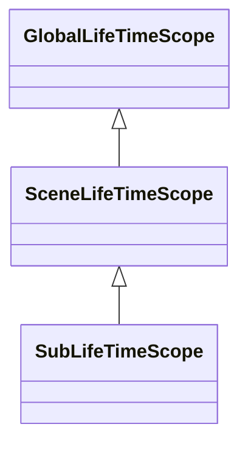
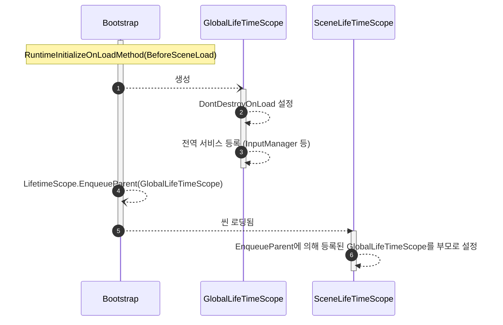

## 구상
* 모든 씬이 완전히 로드되기 전 전처리 작업은 `Bootstrap` 클래스에서 담당한다, 
* `RuntimeInitializeOnLoadMethod(BeforeSceneLoad)`를 사용하여 어떤씬에서 시작해도 초기화 로직을 실행하도록 한다
* 전역적인 의존성은 `GlobalLifeTimeScope` 클래스가 담당한다

## 다이어그램

### LifeTimeScope 계층

* `GlobalLifeTimeScope`: 씬에 종속되지 않는 전역적인 의존성
* `SceneLifeTimeScope`: 특정 씬에 종속적인 의존성
* `SubLifeTimeScope`: 특정 기능들에 종속적인 의존성
    * 예를들면 게임씬의 상점기능에 대한 의존성

### 게임 실행시 초기화 시퀀스
