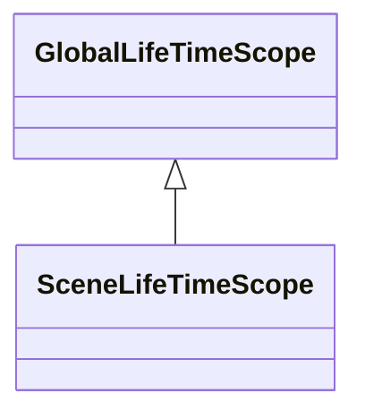
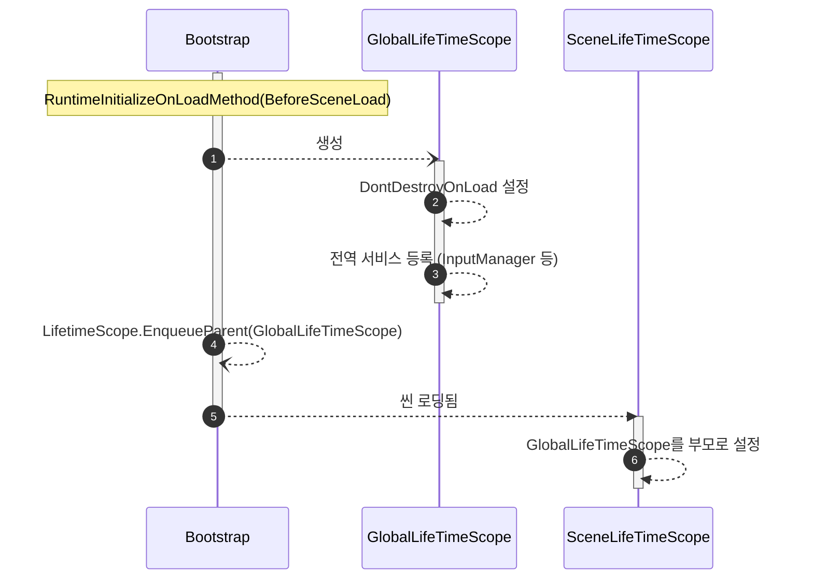
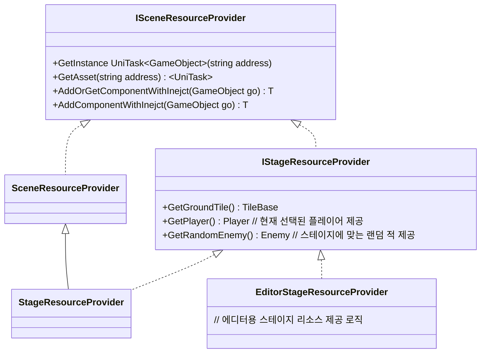

## 구상
* 모든 씬이 완전히 로드되기 전 전처리 작업은 `Bootstrap` 클래스에서 담당한다, 
* `RuntimeInitializeOnLoadMethod(BeforeSceneLoad)`를 사용하여 어떤씬에서 시작해도 초기화 로직을 실행하도록 한다
* 전역적인 의존성은 `GlobalLifeTimeScope` 클래스가 담당한다

## 다이어그램

### LifeTimeScope 계층

* `GlobalLifeTimeScope`: 씬에 종속되지 않는 전역적인 의존성
* `SceneLifeTimeScope`: 특정 씬에 종속적인 의존성

### 게임 실행시 초기화 시퀀스

### SceneResourceProvider : 씬에 필요한 리소스 제공

- 기본적으로 아래의 기능을 담당한다
  - 어드레서블을 이용한 리소스 제공
  - 씬 이동시 로드된 리소스 해제
    - 에셋 로드, 오브젝트 생성, 컴포넌트 추가시 의존성 주입
- 추후 복잡도가 늘어나 분리가 필요하다 판단되면 분리한다