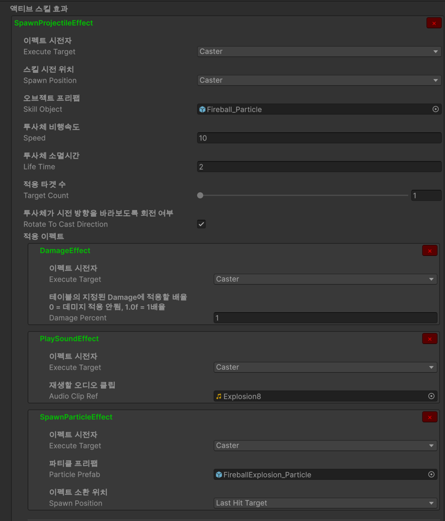

# 로그라이크 던전탐험 게임

### 프로젝트 특징
- VContainer 프레임워크를 사용한 의존성 주입 기반 설계
- CSV 데이터 테이블을 기반으로 한 데이터 주도 설계
  - 수치, 문자열 위주의 데이터는 데이터 테이블 사용
    - 예: 아이템, 스킬, 캐릭터 데이터
    - 
  - 에셋, 게임오브젝트 위주의 데이터는 스크립터블 오브젝트 혹은 프리팹 사용
    - 예: 스킬 사용 효과 시퀀스 데이터
    - 

- BFS 탐색을 통한 랜덤 맵 구조 생성 구현
  - 
 
## 아직 개발이 진행중인 프로젝트 입니다!
- 자세한 프로젝트 구조 설계 & 진행상황은 아래 디렉토리를 참고해주세요
- **[README](README)** 