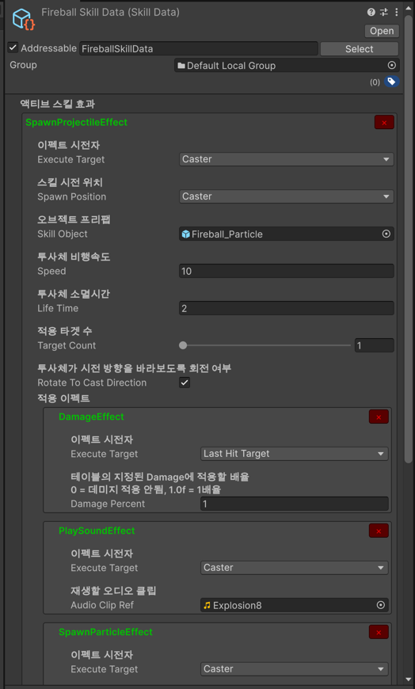
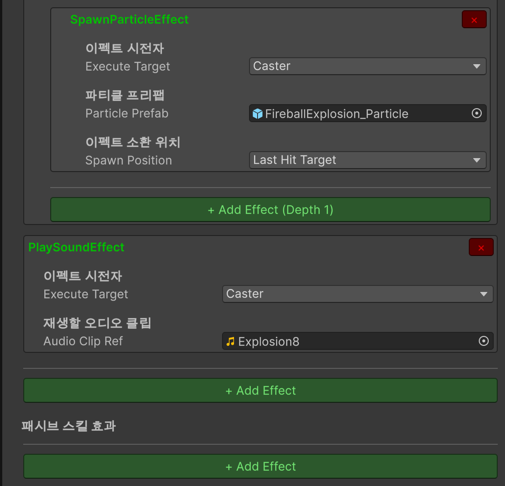
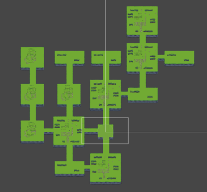

# 프로젝트 소개와 목표
- 랜덤한 구조로 생성되는 던전 속에서 적을 물리치는 로크라이크 던전탐험 게임입니다.
- 유연한 게임 콘텐츠 제작 (캐릭터, 아이템, 스킬 등) 방식을 구현하는데 초점을 두었습니다.
- 아직 완성되지 않았고 개발이 진행중인 프로젝트입니다!
# 프로젝트 특징
- **VContainer 패키지를 활용한 의존성 주입 설계**
- **데이터 테이블을 기반의 데이터 주도 설계**
    - 아이템, 스킬 수치 같은 값 위주의 데이터는 데이터 테이블을 사용함.
    - 스킬 시퀀스 같은 에셋과 게임오브젝트 위주의 데이터는 스크립터블 오브젝트를 통해 작성하도록 함.
- **컴포넌트 조합 기반 설계**
  - 각 기능들을 컴포넌트로 분리하여 컴포넌트 조합에 따라 캐릭터의 기능이 결정되도록 설계
  - 같은 캐릭터 프리팹이라도 어느 팩토리에서 생산하느냐에 따라 적도 될 수 있고 플레이어도 될 수 있도록 설계
- **리포지토리, 팩토리 패턴 활용 설계**
  - 리포지토리와 팩토리 패턴을 활용하여 리소스가 어디서 오는지, 어떻게 초기화 되는지 사용자가 신경 쓸 필요 없이 리소스를 사용할 수 있도록 설계
- **에디터에서 맵과 오브젝트를 배치할 수 있는 에디터, 맵 구조 랜덤생성**
  - 스테이지를 구성하는 방을 에디터로 편집하고 직렬화하여 저장하거나 역직렬화하여 불러올 수 있도록 함
  - 그래프 기반의 맵 랜덤생성 구현
- **다이어그램, 설계 기반의 프로젝트 진행**
  - 각 주요 기능들에 대한 설계 방향과 구조를 작성하고 그에 기반하여 프로젝트 진행
  - [README](README) 폴더 참고

# 프로젝트 실행 방법
- Unity 6000.0.62f1 설치
- 게임을 테스트하려면 MainMenuScene 씬에 진입해 플레이 합니다.
- 맵 에디터를 테스트하려면 RoomEditor 씬에 진입해 RoomEditor 게임오브젝트를 클릭합니다.

# 조작방법
이동 : WASD
구르기 : 스페이스 바 
무기 공격 : J
스킬 1, 2 : K,L

# 프로젝트 폴더 구조
```
Assets/
├── Game/ # 인 게임 씬 관련 (Stage, Player, Enemy, Skills, UI, Inventory 등)
├── Common/ # 공용 (ResourceProviders, SceneLoad, 파사드 등)
├── Core/ # VContainer LifetimeScope, Bootstrap
├── DataTables/ # CSV 파서, TableRepository, 테이블 엔트리 타입
├── Scenes/ # MainMenu, Stage, RoomEditor 등
└── MainMenu/ # 메인 메뉴 씬 관련
```

# 스크린샷
- 스킬 데이터 테이블 CSV 파일
  - 
- 스킬의 동작을 정의 하는 스킬 시퀀스 데이터 스크립터블 오브젝트
  - 
  - 

- 스테이지 실행 후 랜덤 생성된 맵 구조
  - 

# 📦 프로젝트 버전, 의존성
- 프로젝트 버전
  - 6000.0.62f1
- 사용 패키지
    - Addressables
    - VContainer
    - Chinemachine
    - UniTask
    - 2D Tilemap
    - Dotween
    - Jin5eok_Unity_Library : https://github.com/JIN5EOK/JIN5EOK_Unity_Library

