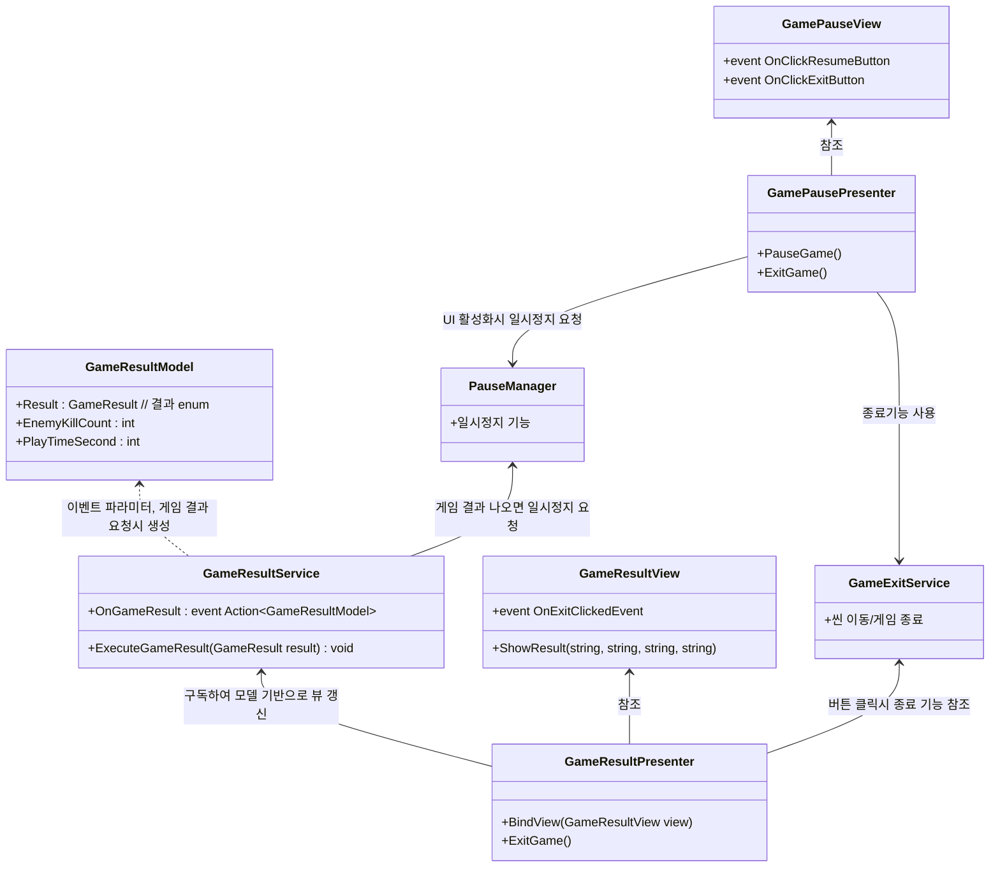

### 클래스 다이어그램

# 개요
- 게임 종료처리, 결과처리, 중단처리가 미구현 됨
- 관련 서비스 클래스를 추가하고 UI를 만들기

# 다이어그램 및 구상

### 구상
- 기능 서비스
  - `PauseManager` 
    - 일시정지 기능 서비스
  - `GameExitService` (구현 필요)
    - 씬 이동과 같은 게임 종료 기능 서비스
  - `PlayTimerService` (구현 필요)
    - 게임 시작 후 지난 시간 담당 서비스