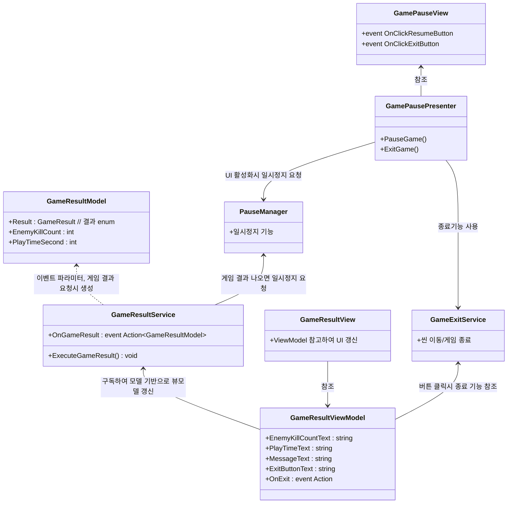

### 클래스 다이어그램

```mermaid
classDiagram
    class PauseManager {
        +일시정지 기능
    }

    class GameExitService {
        +씬 이동/게임 종료
    }

    class GamePauseView {
        +event OnClickResumeButton
        +event OnClickExitButton
    }

    class GamePausePresenter {
        +PauseGame()
        +ExitGame()
    }

    class GameResultView {
        +ViewModel 참고하여 UI 갱신
    }

    class GameResultModel {
        +Result : GameResult // 결과 enum
        +EnemyKillCount : int
        +PlayTimeSecond : int
    }

    class GameResultViewModel {
        +EnemyKillCountText : string
        +PlayTimeText : string
        +MessageText : string
        +ExitButtonText : string
        +OnExit : event Action
    }
    
    class GameResultService{
        +OnGameResult : event Action~GameResultModel~
        +ExecuteGameResult() void
    }
    
    GamePauseView <-- GamePausePresenter : 참조
    GamePausePresenter --> PauseManager : UI 활성화시 일시정지 요청
    GamePausePresenter --> GameExitService : 종료기능 사용
    GameResultService <-- GameResultViewModel : 구독하여 모델 기반으로 뷰모델 갱신
    GameResultModel <.. GameResultService : 이벤트 파라미터, 게임 결과 요청시 생성
    PauseManager <-- GameResultService : 게임 결과 나오면 일시정지 요청
    GameResultView --> GameResultViewModel : 참조
    GameExitService <-- GameResultViewModel : 버튼 클릭시 종료 기능 참조
```

### 구상
- 기능 서비스
  - `PauseManager` 
    - 일시정지 기능 서비스
  - `GameExitService` (구현 필요)
    - 씬 이동과 같은 게임 종료 기능 서비스
  - `PlayTimerService` (구현 필요)
    - 게임 시작 후 지난 시간 담당 서비스