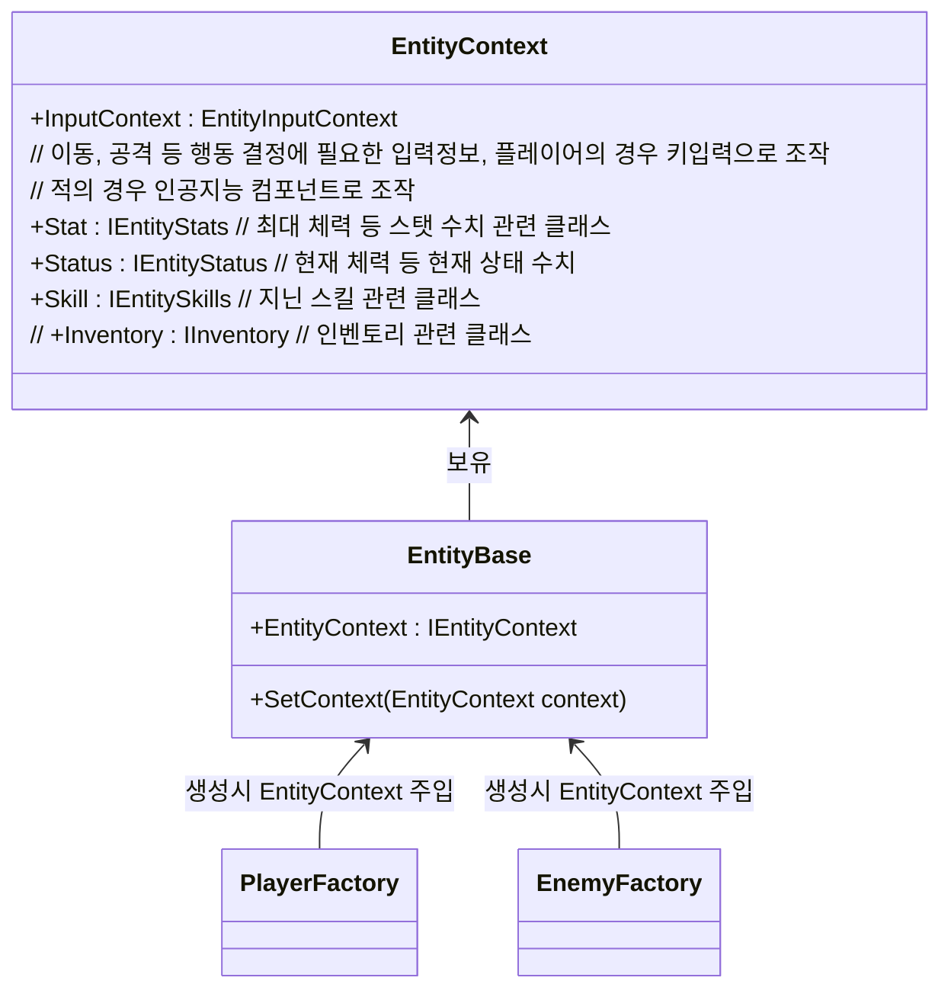
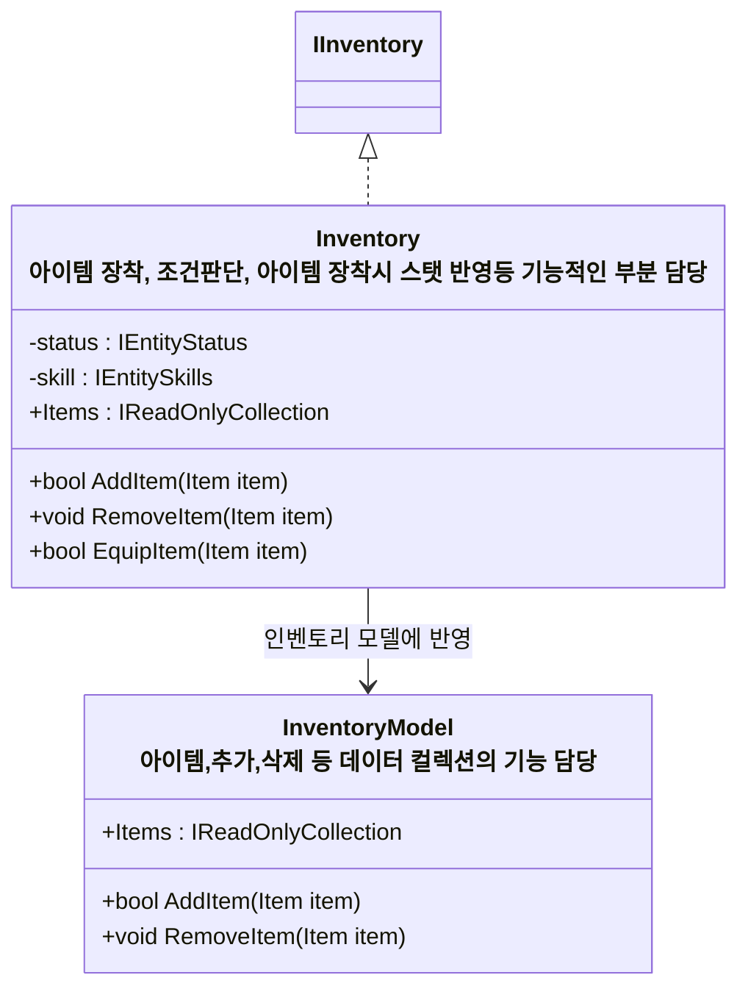

# 개요
> 플레이어, 적 등 게임 내의 Entity 개체들에 대한 설계 문서입니다.

---
## 컴포넌트 조합 기반 설계
* 모든 Entity들의 공통 인터페이스 + 기능 역할을 담당하는 `EntityBase` 컴포넌트와 다수의 기능 컴포넌트로 구성
* 기능 추가는 단일 책임 원칙에 기반한 단일 기능 컴포넌트 추가를 통한 확장 구조를 통해 수행
	* 예시 
      * 캐릭터 이동을 담당하는 `MovementComponent`
      * 체력 연산을 담당하는 `HelathComponent`
      * AI를 담당하는 `AIComponent`
* Entity들의 프리팹 자체에는 기능 컴포넌트를 달아두지 않음, 런타임 조합이나 로직에 따라 어떤 프리팹이라도 플레이어, 적으로 만들 수 있도록 함
  * Player / Enemy에 필요한 컴포넌트와 초기화, 레이어,태그 설정은 `PlayerFactory`/`EnemyFactory`에서 캐릭터를 생성하며 수행
* 각 컴포넌트간 참조관계는 `EntityLifeTimeScope`를 통한 의존성 주입을 통해 해결한다

## 스탯, 스킬 등 데이터 관리, 주입구조

- 플레이어, 적들의 스탯과 스킬 관리 로직이 다르므로 팩토리에서 직접 컨텍스트를 주입한다

### 인벤토리 동작 구조

### 관련 문서
- [스탯시스템_설계.md](%EC%8A%A4%ED%83%AF%EC%8B%9C%EC%8A%A4%ED%85%9C_%EC%84%A4%EA%B3%84.md)
- [스킬시스템_설계.md](%EC%8A%A4%ED%82%AC%EC%8B%9C%EC%8A%A4%ED%85%9C_%EC%84%A4%EA%B3%84.md)

---
