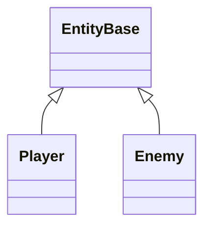
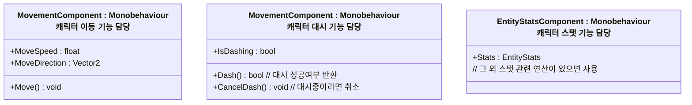
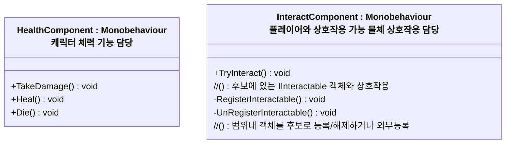
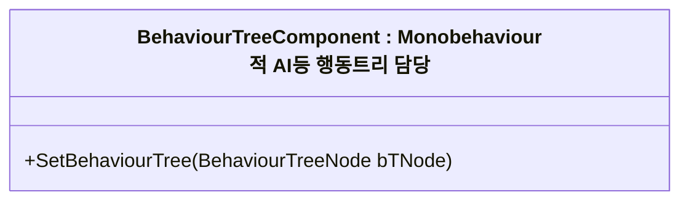
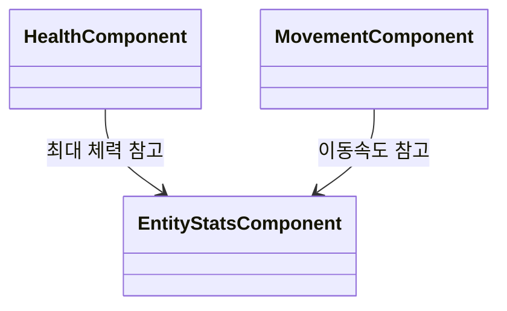

# 개요
플레이어, 적, 보물상자, NPC 등 게임 내의 Entity 개체들에 대한 설계 문서입니다.

---
## 컴포넌트 위주 설계
* 괸리자 역할을 담당하는 컴포넌트 + 다수의 기능 컴포넌트로 구성
* 기능 추가는 단일 책임 원칙을 베이스로 하는 여러 기능 컴포넌트 추가를 통한 확장 구조를 통해 수행
	* 예: 이동 컴포넌트는 이동만 담당하기

## EntityBase - Entity의 중추 기반 클래스

* `EntityBase`를 상속받은 `Player`같은 스크립트는 작동 로직은 최소화하고 주로 아래 역할을 담당한다
  * 객체 초기화
  * 객체 중앙관리

## EntityComponent - Entity의 기능 담당 파트들

### Entity 컴포넌트 예시

### 컴포넌트간 참조는 자유롭게

* `EntityComponent`는 모두 동일한 게임오브젝트에 붙이는걸 전제함
* 따라서 컴포넌트간 참조가 필요하다면 gameObject.GetComponent를 통해 참조
* 특정 컴포넌트가 존재하지 않을 가능성이 존재하므로 다른 컴포넌트를 참조할때 예외처리 반드시 수행

---
