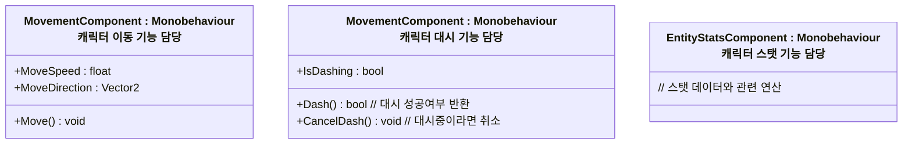
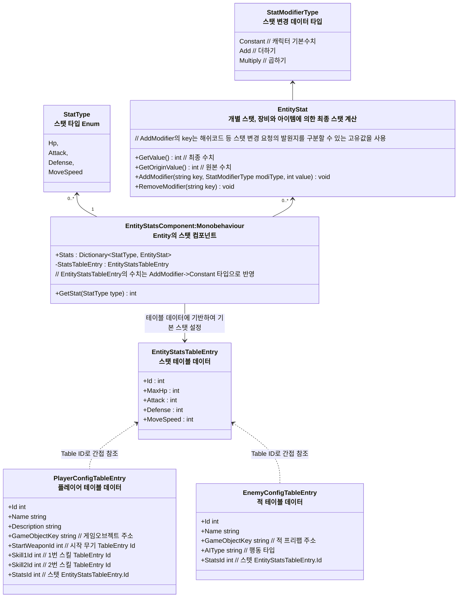

# 개요
플레이어, 적, 보물상자, NPC 등 게임 내의 Entity 개체들에 대한 설계 문서입니다.

---
## 컴포넌트 위주 설계
* 괸리자 역할을 담당하는 컴포넌트 + 다수의 기능 컴포넌트로 구성
* 기능 추가는 단일 책임 원칙을 베이스로 하는 여러 기능 컴포넌트 추가를 통한 확장 구조를 통해 수행
	* 예: 이동 컴포넌트는 이동만 담당하기

## EntityBase - Entity의 중추 기반 클래스

* `EntityBase`를 상속받은 `Player`같은 스크립트는 작동 로직은 최소화하고 주로 아래 역할을 담당한다
  * 객체 초기화
  * 객체 중앙관리

## EntityComponent - Entity의 기능 담당 파트들

### Entity 컴포넌트 예시

### 컴포넌트간 참조는 자유롭게

* `EntityComponent`는 모두 동일한 게임오브젝트에 붙이는걸 전제함
* 따라서 컴포넌트간 참조가 필요하다면 gameObject.GetComponent를 통해 참조
* 특정 컴포넌트가 존재하지 않을 가능성이 존재하므로 다른 컴포넌트를 참조할때 예외처리 반드시 수행

## Entity 스탯 시스템 구조

### 스탯 시스템 구조도

- 스탯 클래스 구분
    - `EntityStatsTableEntry` : 데이터 테이블로 작성하는 개체별 '기본 스탯'
    - `EntityStatsComponent` : Entity마다 개별로 존재하는 스탯 컴포넌트

- Entity 스탯 초기화
    1. `PlayerConfigTableEntry`, `EnemyConfigTableEntry`에서 스탯 ID를 가져온다
    2. `ITableRepository`에서 ID로 조회해 `EntityStatsTableEntry`를 가져온다
    3. 게임오브젝트에 `StatsComponent`를 AddComponent 하고 가져온 `EntityStatsTableEntry`을 삽입, `StatType.Constant` 타입으로 StatModifier을 추가
- Entity 스탯 반영 방법
    - 스택 구조로 최종 스탯값을 결정한다
    - 아이템, 스킬 등에 의해 각 `EtntiyStat`들에 StatModifer들이 추가된다 
    - Constant, Add, Multiply
      - Constant -> 캐릭터의 기본 스텟 값
      - Add -> 수치 더하기
      - Multiply -> 수치 곱하기
        - 100% 단위를 기준으로 한다, 예: 50% -> 0.5배, 200% -> 2배
      - 값 연산시엔 기본값 -> 더하기 -> 곱하기 순으로 연산한다
      - 최종 값들은 한번 연산한후 캐싱해두고 사용, Add,Remove등으로 값 변동이 일어나게 되면 다시 계산한다
        - 더티 플래그 패턴을 사용한다