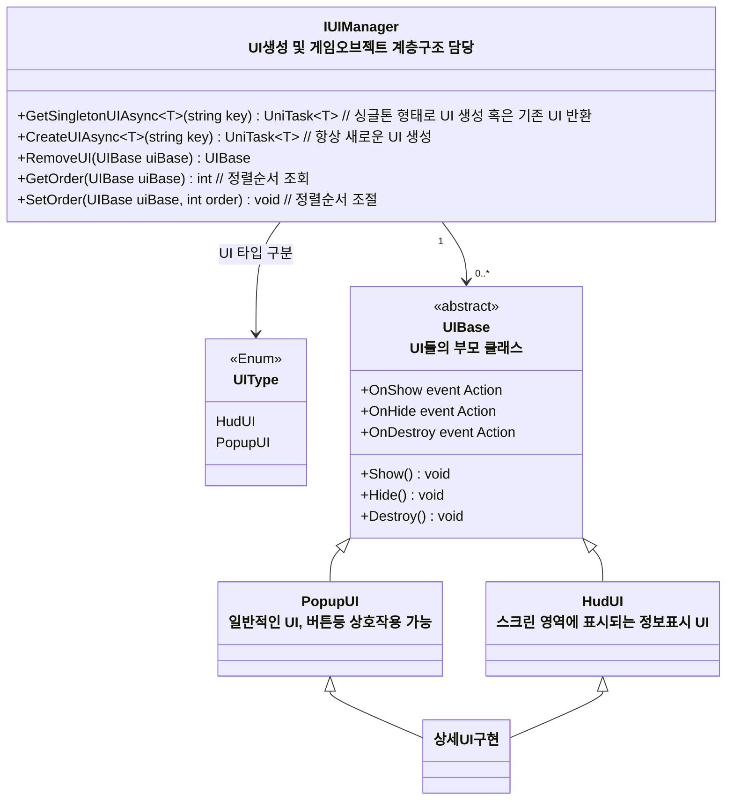
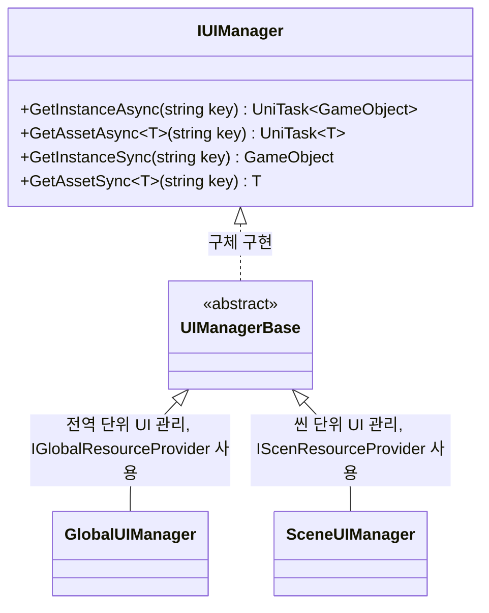

# 개요
> UI 관리를 위한 UIManager, UI를 상속받는 UIBase들에 대한 설계입니다

## UI 구조도

```mermaid
classDiagram
    class UIType{
        <<Enum>>
        HudUI
        PopupUI
    }
    
    class IUIManager["IUIManager<br>UI생성 및 게임오브젝트 계층구조 담당"]{
        +GetSingletonUIAsync~T~(string key) UniTask~T~ // 싱글톤 형태로 UI 생성 혹은 기존 UI 반환
        +CreateUIAsync~T~(string key) UniTask~T~ // 항상 새로운 UI 생성
        +RemoveUI(UIBase uiBase) UIBase
        +GetOrder(UIBase uiBase) int // 정렬순서 조회
        +SetOrder(UIBase uiBase, int order) void // 정렬순서 조절
    }
    
    class UIBase["UIBase<br>UI들의 부모 클래스"]{
        <<abstract>>
        +OnShow event Action
        +OnHide event Action
        +OnDestroy event Action
        +Show() void
        +Hide() void
        +Destroy() void
    }
    class PopupUI["PopupUI<br>일반적인 UI, 버튼등 상호작용 가능"]{
        
    }
    class HudUI["HudUI<br>스크린 영역에 표시되는 정보표시 UI"]{

    }

    IUIManager --> UIType : UI 타입 구분
    IUIManager "1"-->"0..*" UIBase
    UIBase <|-- PopupUI
    UIBase <|-- HudUI
    PopupUI <|-- 상세UI구현
    HudUI<|-- 상세UI구현
```
* `IUIManager` -> UI생성 및 게임오브젝트 계층구조 담당
  * UI 오브젝트 생성 
  * `UIType`별 캔버스 및 계층구조 생성
    * `UIType`별로 캔버스를 생성한다 
    * 캔버스간 정렬 순서는 UIType에 정의된 순서를 따른다 (HudUI < PopupUI)

## 생명주기별 UIManager 분리 구조 

```mermaid
classDiagram
    class IUIManager{
        +GetInstanceAsync(string key) UniTask~GameObject~
        +GetAssetAsync~T~(string key) UniTask~T~
        +GetInstanceSync(string key) GameObject
        +GetAssetSync~T~(string key) T
    }

    class GlobalUIManager{

    }

    class SceneUIManager{

    }

    class UIManagerBase{
        <<abstract>>
    }


    IUIManager <|.. UIManagerBase : 구체 구현
    UIManagerBase <|-- GlobalUIManager : 전역 단위 UI 관리, IGlobalResourceProvider 사용
    UIManagerBase <|-- SceneUIManager : 씬 단위 UI 관리, IScenResourceProvider 사용

```
- 전역적으로 사용되는 UI는 `GlobalUIManager` 사용
  - `GlobalUIManager`는 `GlobalResourceProvider`를 사용하며 이 프로바이더는 게임이 끝날 때 까지 로드한 에셋을 해제시키지 않으므로 주의 필요함
- 씬 단위로 사용되는 UI는 `SceneUIManager` 사용, 씬을 벗어나면 UI 자동 파괴

## UI 아키텍쳐 패턴 관련
- 수치, 값, 텍스트를 많이 설정해야 함, 업데이트가 중요한 UI
  - MVVM 사용
- 실시간 업데이트보단 절차적인 상호작용이 필요한 일반적인 UI
  - MVP 사용
- 기능이 단순한 UI
  - UI 스크립트 하나만 두고 사용

## 추후 고려사항
- 캔버스 리빌드를 고려하여 자주 갱신되는 UI들을 다른 캔버스에 둘 수 있도록 하기
- 현재 프로파일링 결과 UI 렌더링은 비중이 높지 않아 고려사항 아님