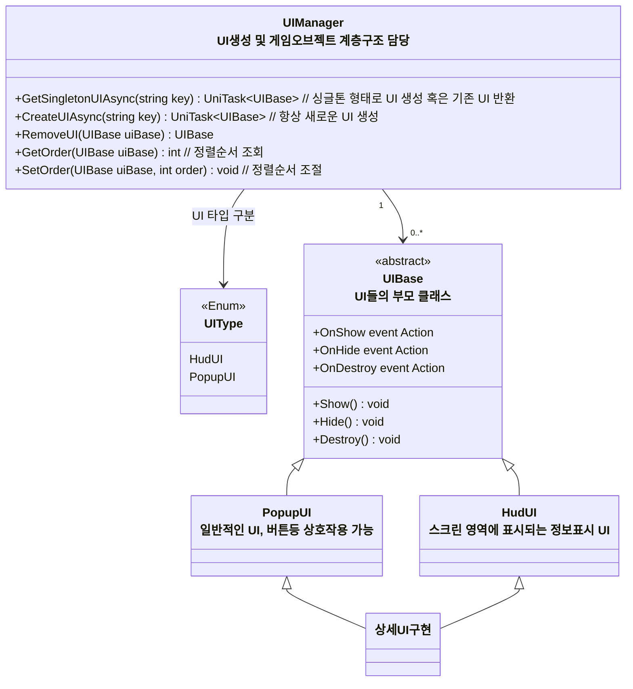

# 개요
> UI 관리를 위한 UIManager, UI를 상속받는 UIBase들에 대한 설계입니다

### UI 구조도

* `UIManager` -> UI생성 및 게임오브젝트 계층구조 담당
  * UI 오브젝트 생성 
  * `UIType`별 캔버스 및 계층구조 생성
    * `UIType`별로 캔버스를 생성한다 
    * 캔버스간 정렬 순서는 UIType에 정의된 순서를 따른다 (HudUI < PopupUI)