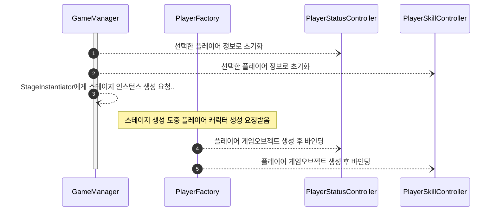

# 임시작성중...

# 개요
> 인게임 매니저들에 대한 설계 문서입니다
> 
# 플레이어 게임 오브젝트 관리
> - 플레이어 캐릭터와 스탯,스킬,인벤토리 같은 정보는 별도의 세션으로 관리하고 게임오브젝트 생성시 바인딩 하는 방식으로 다룬다
> - 이유 
>   - 플레이어 관련 데이터가 플레이어 게임오브젝트에 종속되면 게임이 완전히 끝날 때 까지 플레이어 게임오브젝트를 파괴시키거나 다른 게임오브젝트로 교체하는게 불가능해짐.

### 게임 시작시 플레이어 게임오브젝트 초기화 시퀀스

- GameManager가 스테이지를 초기화 할때 먼저 플레이어가 선택한 정보를 기반으로 각 세션 데이터들을 초기화 한다.
- 이후 PlayerFactory가 플레이어 게임오브젝트를 생성할때 해당 정보를 게임오브젝트에 바인딩한다.

### 플레이어 세션 데이터 & 컨트롤러

```mermaid
classDiagram
    class PlayerStatusController["PlayerStatusController<br>플레이어 스탯 담당"]{
        +StatGroup : EntityStatGroup // 플레이어 스탯 그룹
        +Hp : int // 플레이어의 현재 Hp, HealthComponent의 체력과 동기화
        +Exp : int // 경험치
        +Level // 레벨
        +EntityBase playerInstance
        
        +BindPlayerInstance(EntityBase entity) void // 인스턴스 바인딩
        +UnbindPlayerInstance(EntityBase entity) void
    }
    
    class PlayerSkillController["PlayerSkillController<br>플레이어 고유 스킬 및 스킬 레벨업 처리 담당"]{
        +SkillGroup : EntitySkillGroup // 플레이어의 스킬 그룹
        +EntityBase playerInstance
        +PlayerSkillController(EntitySkillGroup skillGroup)
        +SetActiveSkill1(Skill skill) bool // 스킬을 액티브 스킬로 등록
        +SetActiveSkill2() bool
        +SkillLevelUp(Skill skill) Skill // 스킬 레벨업
        +BindPlayerInstance(EntityBase entity) void // 인스턴스 바인딩
        +UnbindPlayerInstance(EntityBase entity) void
    }

    class Inventory["Inventory<br>소지 아이템 인벤토리"]{
        +StatController PlayerStatController
        +SkillController PlayerSkillController
        ...
    }
    class PlayerInputController["PlayerInputController<br>인게임 키 입력 핸들링 클래스"]{
        +StageInputController(EntityBase playerInstance)
        
        +HandleInputMove(Vector2 vector) void
        +HandleInputEscape(bool input) void
        ... () // 그 외 입력 관련 핸들링 함수들
        +BindPlayerInstance(EntityBase entity) void // 인스턴스 바인딩
        +UnbindPlayerInstance(EntityBase entity) void
     }
    %% SkillCooldownHudUI <-- PlayerSkillController : 액티브 스킬 등록시 쿨다운 UI 등록
    %% PlayerInputController <-- PlayerSkillController : 액티브 스킬 등록시 입력 이벤트 등록
```

- 역할
  - 플레이어 게임오브젝트와 독립된 세션 데이터 관리 수행
  - 플레이어 게임오브젝트 바인딩시 서로 데이터 연동

# 그 외 클래스 정보

- `GameManager`
    - 게임 스테이지의 시작(스테이지 생성)과 끝을 담당(게임 종료)
    - 그 외 인게임 내 슈퍼클래스의 역할이 필요하다면 담당
- `TimeScaleManager`
    - 게임의 일시정지 여부를 결정
    - 레퍼런스 카운트 방식으로 설계, 일시정지가 필요한 객체들은 일시정지를 요청하고 필요없어지면 해제 요청, 현재 요청 갯수가 0이 되어야 일시정지가 풀리도록 함
