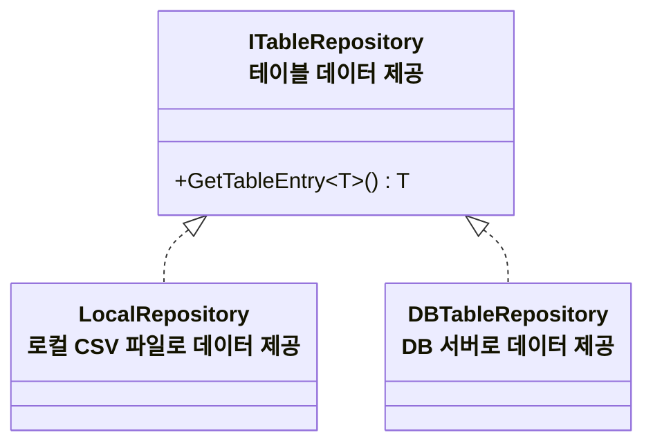

# 개요
> 아이템, 스킬, 몬스터 등 데이터 테이블에 대한 설계입니다

* 수치, 값 위주의 데이터를 테이블로 관리
* 프리펩, 에디터의 기능을 많이 사용해야 하는 부분들은 스크립터블 오브젝트 등으로 관리

# 다이어그램

```mermaid
classDiagram
    class ITableRepository["ITableRepository<br>테이블 데이터 제공"]{
	    +GetTableEntry~T~() T
	}
	
	class LocalTableRepository["LocalRepository<br>로컬 CSV 파일로 데이터 제공"]{

	}
	
	class DBTableRepository["DBTableRepository<br>DB 서버로 데이터 제공"]{

	}
	
	ITableRepository <|.. LocalTableRepository
	ITableRepository <|.. DBTableRepository
```