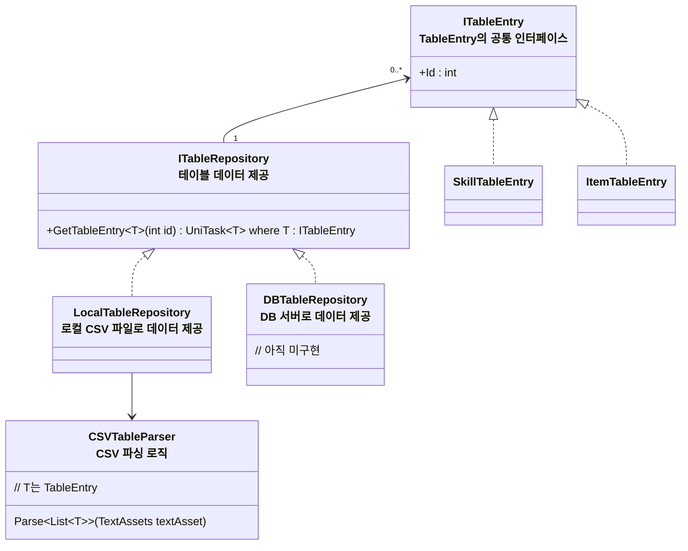

# 개요
> 아이템, 스킬, 몬스터 등 데이터 테이블에 대한 설계입니다

* 기획상 수정, 일괄편집이 필요한 수치, 값 위주의 데이터를 테이블로 관리
* 프리펩, 에디터의 기능을 많이 사용해야 하는 부분들은 스크립터블 오브젝트 등으로 관리

# 다이어그램

### 테이블 리포지토리

* `ITableRepository`
    * `LocalTableRepository`
      * 어드레서블을 통해 CSV 파일을 TextAsset 형태로 가져옴
      * `CSVTableParser`를 통해 로컬 CSV 데이터를 기반으로 파싱된 Entry들을 제공받은후 캐싱
    * 사용자에게 실질적으로 TableEntry 제공
    * `ITableRepository`는 `GlobalLifeTimeScope`에서 게임을 시작하자마자 초기화, 게임 내내 들고 있도록 함
        * 추후 데이터가 많아질 경우 최적화 전략 필요하나 지금은 이렇게 구현
* `CSVTableParser`
    * 기본 CSV 파일 생성 (MenuItem 사용, 에디터 전용 기능)
        * `SkillTableEntry`, `ItemTableEntry`들을 생성하는데 필요한 정보를 담을 수 있는 기본 CSV파일 생성
        * 1행에 변수 이름을 담고 2행부터 데이터를 담을 수 있도록 비워두기
    * CSV 파일에서 데이터를 읽어 `SkillTableEntry`, `ItemTableEntry` 등으로 역직렬화
        * 변환할 때 기본적으로 1:1 변환, int Id라면 Id 열의 값을 담으면 됨
        * `SkillTableEntry.IntAmounts`, `SkillTableEntry.FloatAmounts` 의 경우 문자열 키 : 값 형태의 값을 담음, 각 요소들은 '/'로 구분
          * 예: -> IntAmounts 열에 두가지 값을 담으려면 "myIntAmount1:10/myIntAmount2:10" 로 표현
          * 파싱할때 이 문자열을 파싱하여 각각 IntAmounts, FloatAmounts 딕셔너리에 삽입