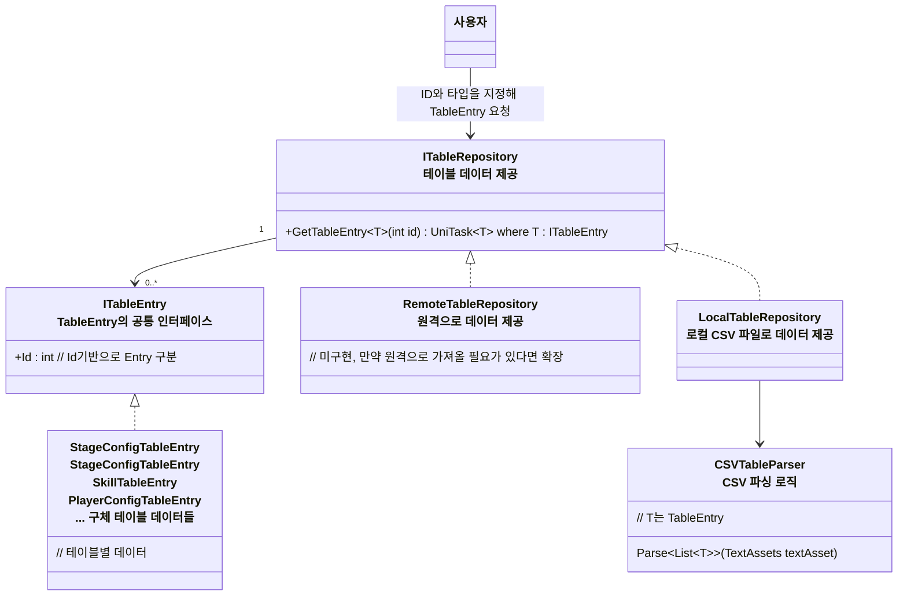

# 개요
> 아이템, 스킬, 몬스터 등 데이터 테이블에 대한 설계입니다

* 대량의 수치 기반 데이터를 ID기반 테이블로 관리
* 프리펩, 에디터의 기능을 많이 사용해야 하는 부분들은 스크립터블 오브젝트 등으로 관리
* 리포지토리 패턴으로 데이터를 제공하고 제공하는 방식은 인터페이스로 감춤

# 다이어그램

## ITableEntry와 TableRepository

```mermaid
classDiagram
    class ITableRepository["ITableRepository<br>테이블 데이터 제공"]{
	    +GetTableEntry~T~(int id) UniTask~T~ where T : ITableEntry
	}
	
	class LocalTableRepository["LocalTableRepository<br>로컬 CSV 파일로 데이터 제공"]{

	}
	
	class RemoteTableRepository["RemoteTableRepository<br>원격으로 데이터 제공"]{
        // 미구현, 만약 원격으로 가져올 필요가 있다면 확장
	}
	
	class CSVTableParser["CSVTableParser<br>CSV 파싱 로직"]{
	    Parse~List~T~~(TextAssets textAsset) 
	    // T는 TableEntry
    }
	
	class ITableEntry["ITableEntry<br>TableEntry의 공통 인터페이스"]{
	    +Id : int // Id기반으로 Entry 구분
    }
    class 테이블데이터들["StageConfigTableEntry<br>StageConfigTableEntry<br>SkillTableEntry<br>PlayerConfigTableEntry<br>... 구체 테이블 데이터들"]{
        // 테이블별 데이터
    }

    ITableEntry <|.. 테이블데이터들
    ITableRepository "1"-->"0..*" ITableEntry
	ITableRepository <|.. LocalTableRepository
    LocalTableRepository --> CSVTableParser
    ITableRepository <|.. RemoteTableRepository
    사용자 --> ITableRepository : ID와 타입을 지정해 TableEntry 요청
```

* `ITableRepository`
    * `LocalTableRepository`
      * 어드레서블을 통해 CSV 파일을 TextAsset 형태로 가져옴
      * `CSVTableParser`를 통해 로컬 CSV 데이터를 기반으로 파싱된 `ITableEntry`들을 제공받은후 캐싱
    * `ITableRepository`는 `GlobalLifeTimeScope`에서 게임을 시작하자마자 초기화, 게임 내내 들고 있도록 함
        * 추후 데이터가 매우 많아질 경우 최적화 전략 필요할수도 있으나 일단은 이렇게 해도 충분할것으로 보임
* `CSVTableParser`
  * CSV 파일에서 데이터를 읽어 `SkillTableEntry`, `ItemTableEntry` 등으로 역직렬화
      * 변환할 때 기본적으로 1:1 변환, int Id라면 Id 열의 값을 담으면 됨
      * `SkillTableEntry.IntAmounts`, `SkillTableEntry.FloatAmounts` 의 경우 문자열 키 : 값 형태의 값을 담음, 각 요소들은 '/'로 구분
      * 예: -> IntAmounts 열에 두가지 값을 담으려면 "myIntAmount1:10/myIntAmount2:10" 로 표현
  * 파싱할때 이 문자열을 파싱하여 각각 IntAmounts, FloatAmounts 딕셔너리에 삽입
* `CSVTableGenerator`
  * 기본 CSV 파일 생성 (MenuItem 사용, 에디터 전용 기능)
  * `SkillTableEntry`, `ItemTableEntry`등 테이블을 생성하는데 필요한 정보를 담을 수 있는 기본 CSV파일 생성
  * 1행에 변수 이름을 담고 2행부터 데이터를 담을 수 있도록 비워두기

## 개선 방향
- **목표**
    - 스크립터블 오브젝트들의 익스포트/임포트 지원
    - 이름이 Key등으로 선언된 string => 어드레서블 에셋 레퍼런스로 변경
    -  ITableEntry 를 상속받는 테이블 내의 데이터들을 스크립터블 오브젝트 데이터로 변환한다
- **개별 개선방향**
    - **EnemyConfigTable**
        - 행마다 스크립터블 오브젝트 하나 생성
        - 스탯 데이터를 참조하는 대신 스크립터블 오브젝트 내에 스탯 클래스 포함
    - **EntityStatsTable**
        - 제거 (캐릭터 데이터에 스크립터블 오브젝트 포함)
        - 아이템 드랍률은 딕셔너리 대신 구조체로 변경, 아이템 스크립터블 오브젝트 레퍼런스 필드 + 정수형 드랍률 필드
    - **ItemTable**
        - 행마다 스크립터블 오브젝트 생성
    - **PlayerConfigTable**
        - 행마다 스크립터블 오브젝트 하나 생성
        - 스탯 데이터를 참조하는 대신 스크립터블 오브젝트 내에 스탯 클래스 포함
    - **SkillTable**
        - 동일한 스킬일 경우 동일 스크립터블 오브젝트 생성, SkillData와는 별개의 스크립터블 오브젝트로 분리 (SkillTable가 SkillData의 레퍼런스를 참조)
        - 스크립터블 오브젝트내에 레벨별 데이터 저장 가능하게 하기
        - Float Amount , Int Amount 완전 제거 (현재 사용하지 않음)
    - **StageConfigTable**
        - 행마다 스크립터블 오브젝트 생성
    - **StringTextTable**
        - 데이터 소스를 Localization 기반으로 변경, (Localization Table 생성)
        - 일단 ITableRepository를 통해 호출하는 호출부는 변경하지 않아도 되도록하기
    - **RoomEventTriggerTable**
        - 제거
- **특이사항**
    - SkillTable의 경우 같은 스킬이지만 레벨이 다른 스킬들이 존재함, 이것들을 같은 스크립터블 오브젝트로 묶어줘야함