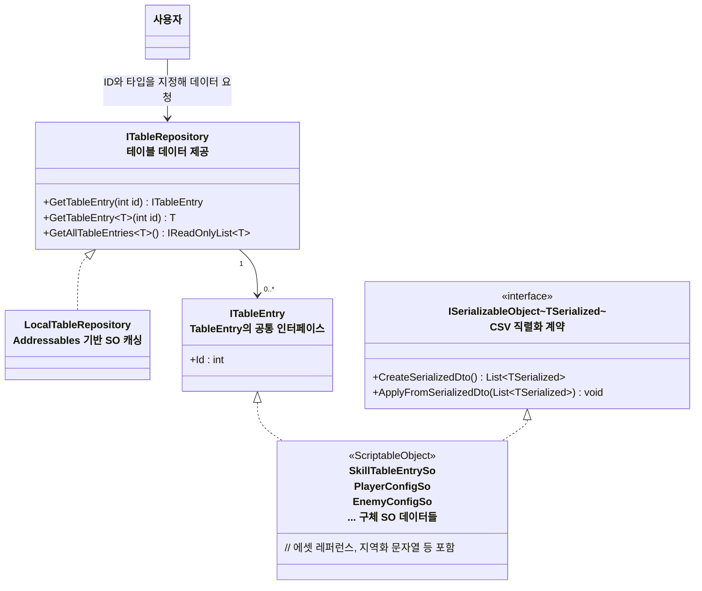
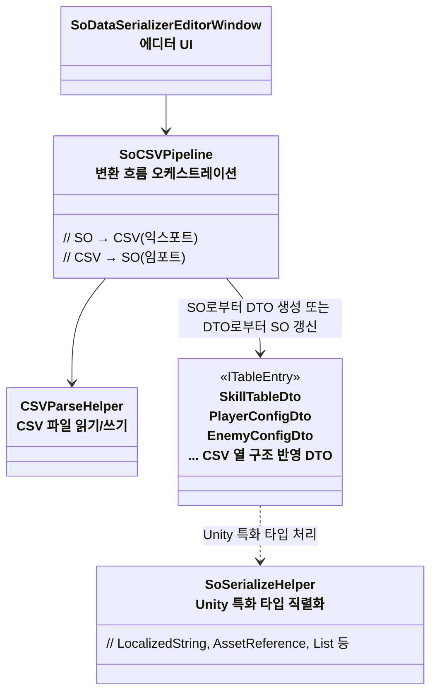

# 개요
> 아이템, 스킬, 몬스터 등 데이터 테이블에 대한 설계입니다

* 대량의 수치 기반 데이터를 ID기반 테이블로 관리
* 프리팹, 에셋 할당 등이 필요한 데이터는 스크립터블 오브젝트로 관리
* 리포지토리 패턴으로 데이터를 제공하고 제공하는 방식은 인터페이스로 감춤
* CSV는 런타임에 사용하지 않으며, 에디터에서 스크립터블 오브젝트와 상호 변환하는 편집 도구로만 활용

# 다이어그램

## 런타임 데이터 접근 구조

```mermaid
classDiagram
    class ITableRepository["ITableRepository<br>테이블 데이터 제공"]{
        +GetTableEntry(int id) ITableEntry
        +GetTableEntry~T~(int id) T
        +GetAllTableEntries~T~() IReadOnlyList~T~
    }

    class LocalTableRepository["LocalTableRepository<br>Addressables 기반 SO 캐싱"]{
    }

    class ITableEntry["ITableEntry<br>TableEntry의 공통 인터페이스"]{
        +Id : int
    }

    class ISerializableObject["ISerializableObject~TSerialized~<br>CSV 직렬화 계약"]{
        <<interface>>
        +CreateSerializedDto() List~TSerialized~
        +ApplyFromSerializedDto(List~TSerialized~) void
    }

    class 구체SO["SkillTableEntrySo<br>PlayerConfigSo<br>EnemyConfigSo<br>... 구체 SO 데이터들"]{
        <<ScriptableObject>>
        // 에셋 레퍼런스, 지역화 문자열 등 포함
    }

    ITableEntry <|.. 구체SO
    ISerializableObject <|.. 구체SO
    ITableRepository "1" --> "0..*" ITableEntry
    ITableRepository <|.. LocalTableRepository
    사용자 --> ITableRepository : ID와 타입을 지정해 데이터 요청
```

* `ITableRepository`
    * 사용 측은 ID와 원하는 타입만 지정하면 데이터를 받을 수 있음
    * `LocalTableRepository`는 게임 시작 시 Addressables를 통해 SO들을 라벨 기반으로 로드하고 ID로 캐싱
    * `ITableRepository`는 `GlobalLifeTimeScope`에서 초기화, 게임 내내 유지
* SO 데이터
    * 에셋 레퍼런스(`AssetReference`), 지역화 문자열(`LocalizedString`) 등을 필드로 가짐
    * `ISerializableObject`를 함께 상속하여 CSV 편집 도구와 연동 가능

## 에디터 CSV 편집 구조

```mermaid
classDiagram
    class SoDataSerializerEditorWindow["SoDataSerializerEditorWindow<br>에디터 UI"]{
    }

    class SoCSVPipeline["SoCSVPipeline<br>변환 흐름 오케스트레이션"]{
        // SO → CSV (익스포트)
        // CSV → SO (임포트)
    }

    class CSVParseHelper["CSVParseHelper<br>CSV 파일 읽기/쓰기"]{
    }

    class SoSerializeHelper["SoSerializeHelper<br>Unity 특화 타입 직렬화"]{
        // LocalizedString, AssetReference, List 등
    }

    class 구체DTO["SkillTableDto<br>PlayerConfigDto<br>EnemyConfigDto<br>... CSV 열 구조 반영 DTO"]{
        <<ITableEntry>>
    }

    SoDataSerializerEditorWindow --> SoCSVPipeline
    SoCSVPipeline --> CSVParseHelper
    SoCSVPipeline --> 구체DTO : SO로부터 DTO 생성 또는 DTO로부터 SO 갱신
    구체DTO ..> SoSerializeHelper : Unity 특화 타입 처리
```

* `SoCSVPipeline`
    * **SO → CSV**: 폴더의 SO를 모두 로드 → `CreateSerializedDto`로 DTO 생성 → CSV 저장
    * **CSV → SO**: CSV 파싱 → 동일 ID 행 그룹핑 → SO 생성/갱신 → `ApplyFromSerializedDto` 호출
* DTO 클래스
    * CSV 열 구조를 그대로 반영, `ITableEntry`를 상속
    * 한 SO가 여러 행에 걸쳐 표현될 수 있음 (예: 스킬의 레벨별 데이터)
* `SoSerializeHelper`
    * `LocalizedString`, `AssetReference`, 컬렉션 등 프로젝트 특화 타입의 직렬화 공통 로직 제공

## 구현된 데이터 테이블

| 테이블 | SO 클래스 | 특이사항 |
|-------|----------|---------|
| 스킬 | `SkillTableEntrySo` | 레벨별 데이터를 다행으로 직렬화 |
| 플레이어 설정 | `PlayerConfigSo` | 스탯 포함, 스킬 레퍼런스 포함 |
| 적 설정 | `EnemyConfigSo` | 스탯, AI 타입, 액티브 스킬 레퍼런스 포함 |

* 스탯 데이터(`StatsDto`)는 별도 테이블 없이 각 SO 내부에 포함
* 지역화 문자열은 `StringTextTable` 대신 `LocalizedString`을 각 SO 필드에 직접 사용
