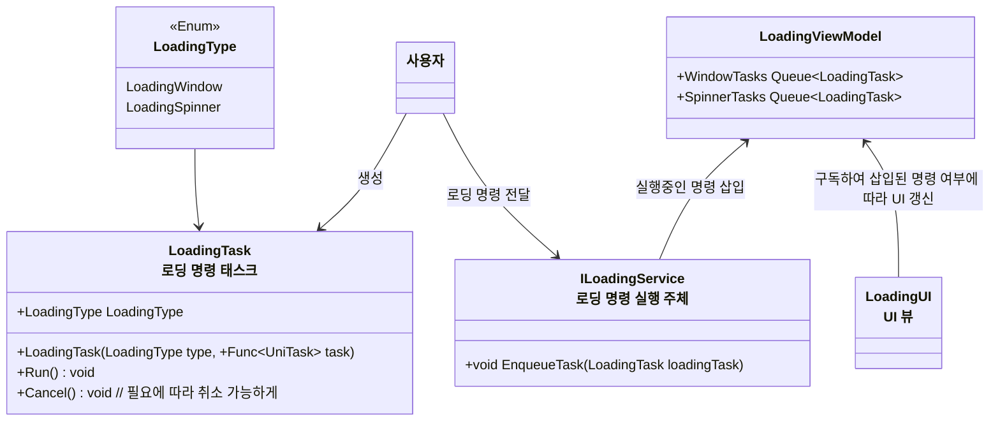

## 로딩 시스템
> 로딩이 필요한 상황에 로딩창을 띄워 미완성된 게임 상황 노출, 플레이어의 클릭등을 막는다

## 로딩 윈도우, 로딩 스피너
- 로딩 윈도우: 화면 전체를 가리는 로딩 윈도우, 씬 이동 등 묵직한 로딩 작업에 사용된다
- 로딩 스피너: 화면을 반투명하게 가리는 로딩 스피너, 버튼 클릭후 비동기 대기 같은 가벼운 로딩 작업에 사용된다

- 고려사항
  - 씬 이동 로딩 같은 경우 씬 이동 이후 씬 초기화 작업들까지 마친 후에 로딩 화면이 제거되어야 함
      - 해당 부분은 `ISceneInitializer`라는 인터페이스 상속 객체를 통해 해결, `SceneLoader`를 통한 씬 로딩시 해당 객체의 초기화를 마칠때까지 기다리는 명령을 자동으로 삽입함 