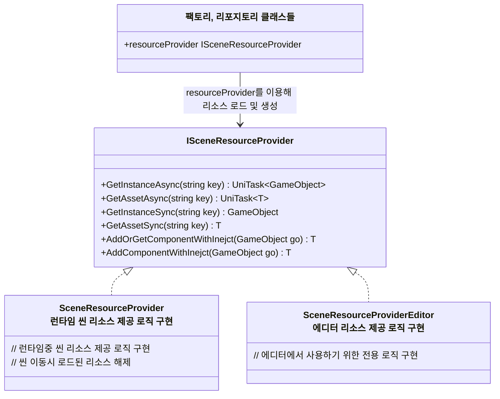

## 개요
> 동적 리소스 관리 구조 체계에 대한 설계 문서입니다.

## SceneResourceProvider : 씬에 필요한 리소스 제공 및 생명주기 관리

- `SceneResourceProvider`의 기본 역할
  - 리소스 로드 & 게임오브젝트 생성
    - 복잡도가 늘어나 분리가 필요하다고 판단되면 별도의 팩토리, 리포지토리등으로 분리
    - 단 이때도 별도의 리소스 생명주기 관리가 필요한게 아니라면 `ResourceProvider`에 의존하도록 만들기
  - 씬 이동시 로드된 리소스 해제
  - 에셋 로드, 오브젝트 생성, 컴포넌트 추가시 의존성 주입
- 특이사항
  - 리소스 불러오기를 위해 내부적으로 어드레서블을 사용
    - 하지만 어드레서블을 사용하지 않는 리소스 프로바이더 추가를 염두에 두기 위해 어드레서블 핸들 대신 `UniTask<T>` 반환
  