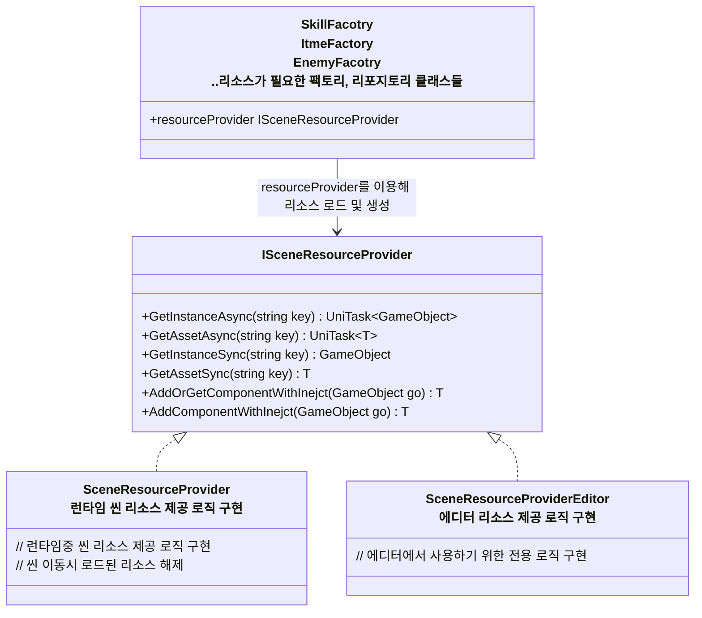

## 개요
> 동적 리소스 관리 구조 체계에 대한 설계 문서입니다.

## SceneResourceProvider : 씬에 필요한 리소스 제공 및 생명주기 관리

- `SceneResourceProvider`의 기본 역할
  - 리소스 로드 & 게임오브젝트 생성
    - 대부분 다른 팩토리,리포지토리 등 리소스 제공자들이 여기에 의존
    - 이유는 리소스들의 생명주기를 씬과 동기화 하기 위함, 씬과 생명주기를 동기화 할 필요가 없다면 의존하지 않아도 됨
  - 씬 이동시 로드된 리소스 해제
  - 에셋 로드, 오브젝트 생성, 컴포넌트 추가시 의존성 주입
- 특이사항
  - 리소스 불러오기를 위해 내부적으로 어드레서블을 사용
    - 하지만 어드레서블을 사용하지 않는 리소스 프로바이더 추가를 염두에 두기 위해 어드레서블 핸들 대신 `UniTask<T>` 반환
  