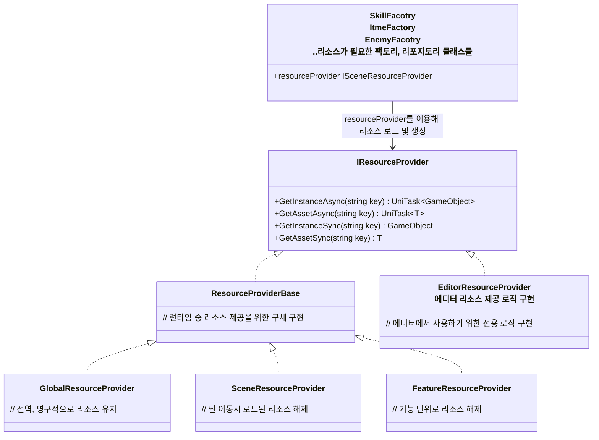

## 개요
> 동적 리소스 관리 구조 체계에 대한 설계 문서입니다.

## 다이어그램

```mermaid
classDiagram
    class IResourceProvider{
        +GetInstanceAsync(string key) UniTask~GameObject~
        +GetAssetAsync<T>(string key) UniTask~T~
        +GetInstanceSync(string key) GameObject
        +GetAssetSync<T>(string key) T
    }

    class ResourceProviderBase{
        // 런타임 중 리소스 제공을 위한 구체 구현
    }
    
    class EditorResourceProvider["EditorResourceProvider<br>에디터 리소스 제공 로직 구현"]{
        // 에디터에서 사용하기 위한 전용  로직 구현
    }

    class GlobalResourceProvider["GlobalResourceProvider<br>"]{
        // 전역, 영구적으로 리소스 유지
    }
    
    class SceneResourceProvider["SceneResourceProvider<br>"]{
        // 씬 이동시 로드된 리소스 해제
    }

    class FeatureResourceProvider["FeatureResourceProvider<br>"]{
        // 기능 단위로 리소스 해제
    }

    class 팩토리들["SkillFacotry<br>ItmeFactory<br>EnemyFacotry<br>..리소스가 필요한 팩토리, 리포지토리 클래스들"]{
        +resourceProvider ISceneResourceProvider
    }

    IResourceProvider <|.. ResourceProviderBase
    ResourceProviderBase <|.. GlobalResourceProvider
    ResourceProviderBase <|.. SceneResourceProvider
    ResourceProviderBase <|.. FeatureResourceProvider
    IResourceProvider <|.. EditorResourceProvider
    팩토리들 --> IResourceProvider : resourceProvider를 이용해 리소스 로드 및 생성
```
- `IResourceProvider`의 기본 역할
  - 에셋 로드 & 게임오브젝트 생성
    - 대부분 다른 팩토리,리포지토리 등 리소스 제공자들이 여기에 의존
  - 기본적으로 각 리소스 프로바이더들이 제공하는 기능은 에셋 로드, 인스턴스 생성이라는 면에서 동일하나 리소스들의 생명주기가 다름.
    - 영구적으로 유지되는 리소스 : `GlobalResourceProvider`사용
    - 씬 단위로 유지되는 리소스 : `SceneResourceProvider`사용
    - 기능 단위로 유지되는 리소스 : `FeatureResourceProvider`사용
    - 에디터 전용 : `EditorResourceProvider`사용
- 특이사항 
  - 리소스 불러오기를 위해 내부적으로 어드레서블을 사용
    - 하지만 어드레서블을 사용하지 않는 리소스 프로바이더 추가를 염두에 두기 위해 어드레서블 핸들 대신 `UniTask<T>` 반환
  - 리소스 프로바이더 생명주기를 명확히 지정해야하는 경우를 제외하면 리소스 프로바이더를 사용하는 개체들은 `IResourceProvider` 인터페이스를 주입받도록 함, `IResourceProvider`의 구체 타입이 어떤건지는 LifeTimeScope에 의해 조율 