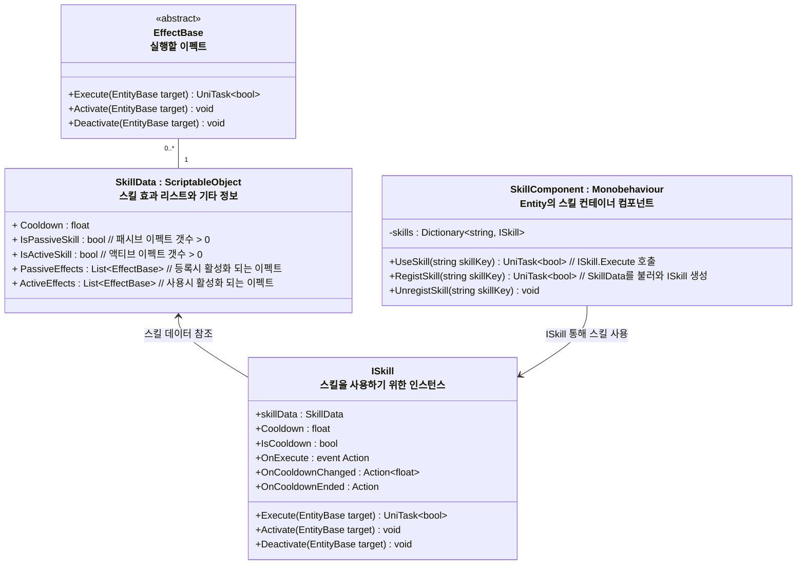
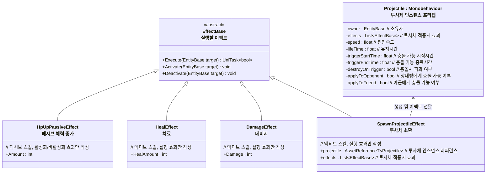

# 개요
> Entity가 사용하는 스킬 시스템 전반에 대한 설계 문서입니다.

---

## 스킬 시스템 구조

- `SkillData` : 스킬 정보, 스크립터블 오브젝트를 통해 편집
	- `ActiveEffects` : 액티브 스킬 효과 리스트
		- 사용자가 직접 사용하는 스킬
		- `ISkill`의 Execute 호출시 실행
	- `PassiveEffects` : 패시브 스킬 효과 리스트
		- `SkillComponent`에 `RegistSkill`시 효과 실행
		- `SkillComponent`에 `UnregistSkill`시 효과 제거
- `SkillComponent` : 여러 스킬 인스턴스를 등록하고 사용 담당
- `ISkill` : 실제 스킬 인스턴스
	- 개별 스킬의 쿨다운 관리, 스킬 이펙트 실행 담당
### `EffectBase`와 파생되는 스킬 이펙트 구조 예시

- `EffectBase`는 다음 역할을 수행
	* `Execute` : 스킬 사용
	* `Activate` : 효과 활성화 (스킬 컴포넌트 등록시 실행)
	* `Deactivate` : 효과 비활성화 (스킬 컴포넌트 해제시 실행)