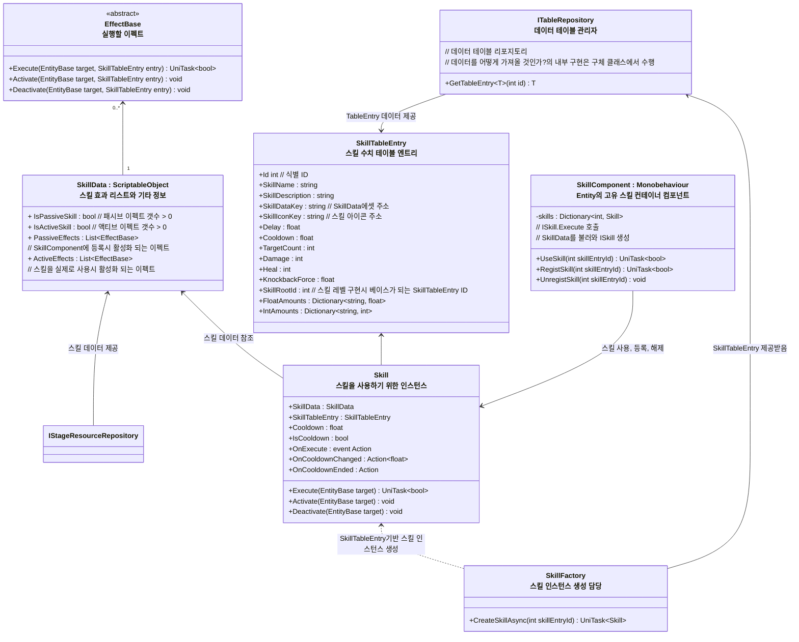
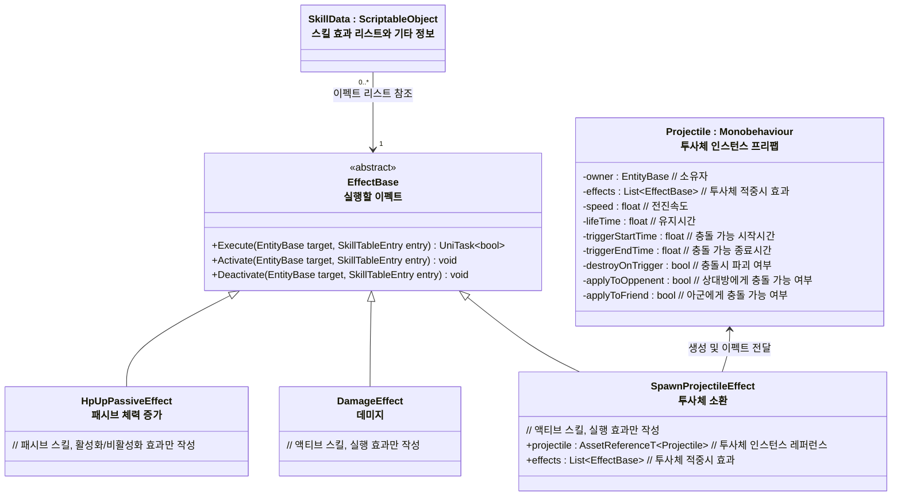

# 개요
> Entity가 사용하는 스킬 시스템 전반에 대한 설계 문서입니다.

---

## 스킬 시스템 구조

- `SkillData` : 스킬의 동작 및 효과 정보, 스크립터블 오브젝트를 통해 편집
	- `ActiveEffects` : 액티브 스킬 효과 리스트
		- 사용자가 직접 사용하여 실행
		- `Skill`의 Execute 호출시 실행
	- `PassiveEffects` : 패시브 스킬 효과 리스트
		- `SkillComponent`에 `RegistSkill`시 효과 실행
		- `SkillComponent`에 `UnregistSkill`시 효과 제거
- `SkillTableEntry` : 스킬과 스킬의 레벨별 수치 정보, CSV등 테이블을 통해 편집
- `SkillFactory` : Id기반으로 스킬 인스턴스 생성 담당
- `SkillComponent` : 캐릭터의 고유 스킬들을 등록하고 사용
- `Skill` : 실제 스킬 인스턴스
	- 개별 스킬의 쿨다운 관리, 스킬 이펙트 실행 담당
    - `SkillComponent` 혹은 `Item`을 통해 실행
- `ITableRepository`
	- 테이블 데이터를 불러오는 리포지토리, 세부 구현은 구체 클래스에서 담당
- `IStageResourceProvider`
	- 에셋을 불러오거나 게임오브젝트 인스턴스 생성 담당

### `EffectBase`와 파생되는 스킬 이펙트 구조 예시

- `EffectBase`는 다음 역할을 수행
	* `Execute` : 스킬 사용
	* `Activate` : 효과 활성화 (스킬 컴포넌트 등록시 실행)
	* `Deactivate` : 효과 비활성화 (스킬 컴포넌트 해제시 실행)

### 스킬 레벨 시스템
- `SkillTableEntry`에서의 ID 규칙을 통해 스킬의 레벨을 구분하고 작성한다
- 규칙은 다음과 같다
  - `SkillRootId`를 정한다, 끝자리가 ..00으로 끝나는 ID를 사용하는걸 기본으로 한다
  - 예: 14000100 을 Root로 정했다고 가정해보자
    - 14000100 : Root ID, 사용할 수 없는 레벨 0스킬로 취급한다
    - 그 뒤로 스킬 레벨이 올라갈때마다 14000101,14000102,14000103 등 끝자리에 1씩 더해가며 레벨별 스킬 데이터를 추가한다
  - 런타임땐 `현재 스킬 Id - SkillRootId` 의 결과값으로 지금 스킬 레벨이 몇인지를 구분한다