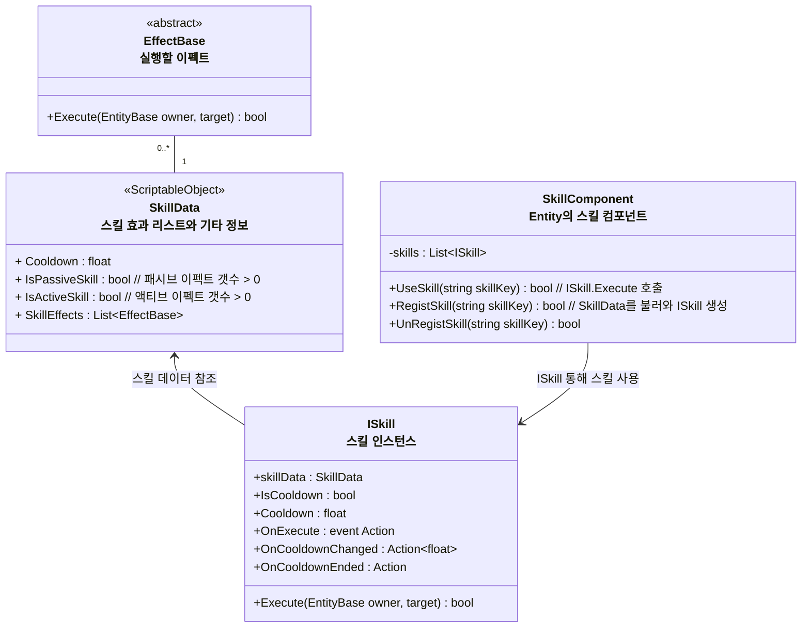
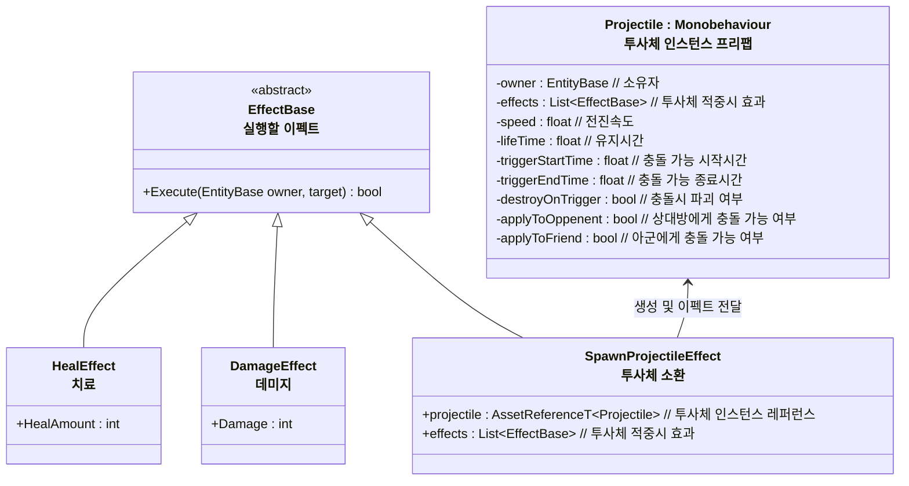

# 개요
> Entity가 사용하는 스킬 시스템 전반에 대한 설계 문서입니다.

---

## 스킬 시스템 구조

- SkillData 스크립터블 오브젝트를 통해 스킬 효과를 작성한다
- 사용자는 Skill 인스턴스를 통해 실제로 스킬을 사용한다
### 스킬 이펙트들

# 임시작성
* `Skill`을 `PassiveSkill`과 `ActiveSkill`로 분리
	* 뭐가 필요한지
		* 액티브 스킬
			* 실행하면 효과 실행
			* 쿨다운
		* 패시브 스킬
			* 등록 즉시 효과 발동
			* 해제하면 효과 제거
* SkillData의 기능을 확장하기
	* 패시브 Effect 리스트
	* IsPassiveSkill 패시브 이펙트가 0개라면 패시브 스킬 아님
	* 액티브 Effect 리스트
	* IsActiveSkill 액티브 이펙트가 0개라면 액티브 스킬 아님
* Skill도 마찬가지로 확장
	* 스킬컴포넌트에 추가/제거시 패시브 스킬 활성화/비활성화
	* 액티브 스킬 사용 가능
* SkillComponent 수정
	* 스킬 컴포넌트 추가시 패시브 효과 적용
* EffectBase는 다음 역할을 수행
			* Exexute : 스킬 사용
			* Activate : 스킬 활성화 (스킬 컴포넌트 등록시 실행, 패시브 효과 추가)
			* Deactivate : 스킬 비활성화 (스킬 컴포넌트 등록시 실행, 패시브 효과 제거)

