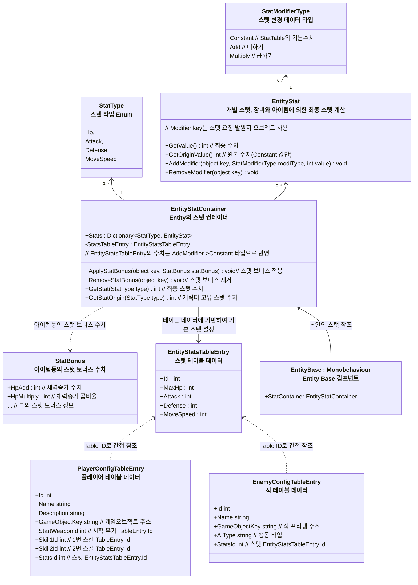

# 개요
> Entity의 스탯 시스템에 대한 설계 문서입니다.
- 특징
  - 스탯 테이블의 기본 스탯을 기반으로 아이템, 스킬등의 보너스 값에 따라 스탯 계산 연산을 적용
## Entity 스탯 시스템 구조

### 스탯 시스템 구조도

- 주요 클래스와 역할
    - `EntityStatsTableEntry` : 데이터 테이블로 작성하는 개체별 '기본 스탯'
    - `EntityStat` : HP, 이동속도 등의 개별 스탯, 추가된 스탯 보너스를 계산하여 최종 스탯 계산
    - `EntityStatContainer` : 개별 스탯들이 모인 컨테이너
- Entity 스탯 초기화
    1. `PlayerConfigTableEntry`, `EnemyConfigTableEntry`에서 스탯 ID를 가져온다
    2. `ITableRepository`에서 ID로 조회해 `EntityStatsTableEntry`를 가져온다
    3. 게임오브젝트에 `StatsComponent`를 AddComponent 하고 가져온 `EntityStatsTableEntry`을 삽입, `StatType.Constant` 타입으로 StatModifier을 추가
- Entity 스탯 반영 방법
    - 합산 구조로 최종 스탯값을 결정한다
    - 기본 스탯 정보, 아이템, 스킬 등에 의해 각 `EntityStat`들에 StatModifer들이 추가된다
    - 스탯 보너스 구조
      - `Constant` -> `EntityStatsTableEntry`에 의해 적용되는 기본 수치 
      - `Add`,`Multiply` -> 아이템등의 `StatBonus`에 의해 적용되는 더하기, 곱셈 보정
          - 100% 단위를 기준으로 한다, 예: 50% -> 0.5배, 200% -> 2배
      - `Constant` -> `Add` -> `Multiply` 순으로 스탯에 반영하여 최종 스탯을 계산해낸다
      - 최종 값들은 한번 연산한후 캐싱해두고 사용, Add,Remove등으로 값 변동이 일어나게 되면 다시 계산한다
        - 더티 플래그 패턴 사용