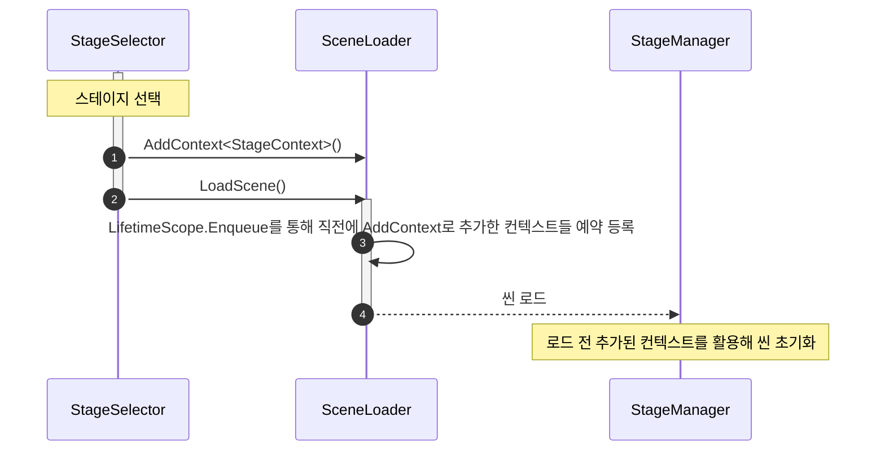

### SceneLoader
* 씬 로드와 더불어 씬에 필요한 의존성 주입 컨텍스트를 설정할 수 있음
* 단일 관리자가 아닌 씬을 로드할때 생성해 사용하는 일회성 객체
* 함수
    * LoadScene(string sceneName) 씬을 로드한다
    * AddContext<T>(T context) 로드할 씬의 LifeTimeScope에 반영할 Context를 추가한다
* 구현사항
    * 씬 로드시 내부적으로 어드레서블 사용
    * 비동기 씬 로드 수행

### SceneLoader 활용한 스테이지 선택창을 통한 스테이지 씬 이동 예시 시퀀스 다이어그램

---
## 참고문서
### VContainer 문서 : Generate child scope via scene or prefab
https://vcontainer.hadashikick.jp/scoping/generate-child-via-scene