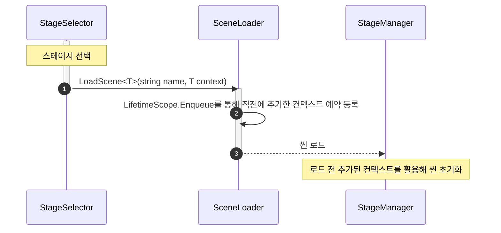

### SceneLoader
* 씬 로드와 더불어 씬에 필요한 의존성 주입 컨텍스트를 설정할 수 있음
* 함수
    * LoadScene(string sceneName) 씬을 로드한다
    * LoadScene\<T>(string sceneName, T context) 컨텍스트와 함께 씬을 로드한다
      * 파라미터로 넘겨진 Context는 로드한 씬의 LifeTimeScope에 Regist된다.
* 구현사항
    * 씬 로드시 내부적으로 어드레서블 사용
    * 비동기 씬 로드 수행

### SceneLoader 활용한 스테이지 선택창을 통한 스테이지 씬 이동 예시 시퀀스 다이어그램

```mermaid
sequenceDiagram
    autonumber
    participant StageSelector
    participant SceneLoader
    participant StageManager
    activate StageSelector
    note over StageSelector: 스테이지 선택
    StageSelector ->> SceneLoader : LoadScene<T>(string name, T context)
    deactivate StageSelector
    activate SceneLoader
    SceneLoader ->> SceneLoader : LifetimeScope.Enqueue를 통해 직전에 추가한 컨텍스트 예약 등록
    SceneLoader -->> StageManager : 씬 로드
    deactivate SceneLoader
    note over StageManager: 로드 전 추가된 컨텍스트를 활용해 씬 초기화
```

---
## 참고문서
### VContainer 문서 : Generate child scope via scene or prefab
https://vcontainer.hadashikick.jp/scoping/generate-child-via-scene