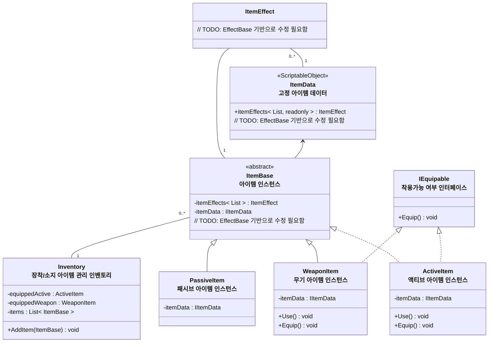
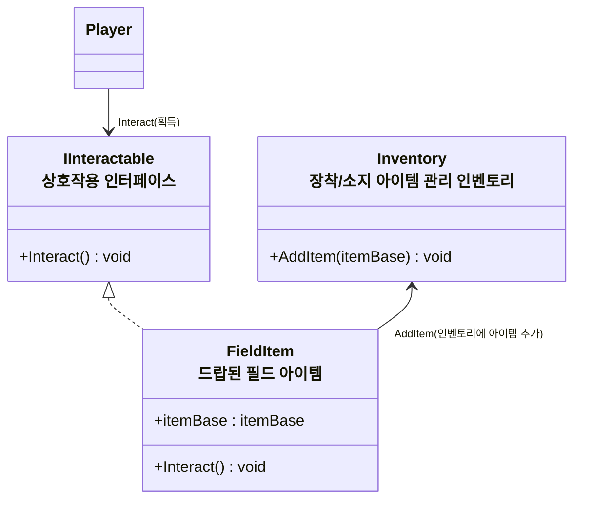

# 개요
> 아이템과 인벤토리 시스템 전반에 대한 설계 문서입니다

# 아이템, 인벤토리 기능
* 인벤토리 스펙
    * 장착 아이템 슬롯
        * 1개의 무기 슬롯
	        * 공격력을 비롯한 스텟
            * 일반공격 스킬과 필살기 스킬
				* 예시 - 장창, 일반공격 - 찌르기, 필살기 - 돌진공격
        * 1개의 액티브 아이템 슬롯
            * 예시 - 치유의 책 : 체력을 회복할 수 있다
    * 인벤토리 영역
        * 아이템들이 저장되는 공간
        * 액티브 아이템, 무기, 패시브 아이템이 저장된다
* 아이템들의 고유 특징
    * 무기
	    * 무기 슬롯에 장착 가능
	        * 해제하기 위해서는 다른 무기를 장착해야 한다
		* 공격버튼, 필살기 버튼을 눌러 공격할 수 있다
    * 액티브
		* 액티브 아이템 슬롯에 장착 가능
			* 해제하기 위해서는 다른 액티브 아이템을 장착해야 한다
        * 액티브 아이템 버튼을 눌러 사용할 수 있다
    * 패시브
        * 소지하면 지속적으로 효과가 부여된다

# 다이어그램

### 인벤토리와 아이템 인스턴스 관계도

### 필드 아이템 (드롭 아이템) 상호작용 구조

- Skill <-> Item 관계를 어떻게 구성할지 고민
	- 
