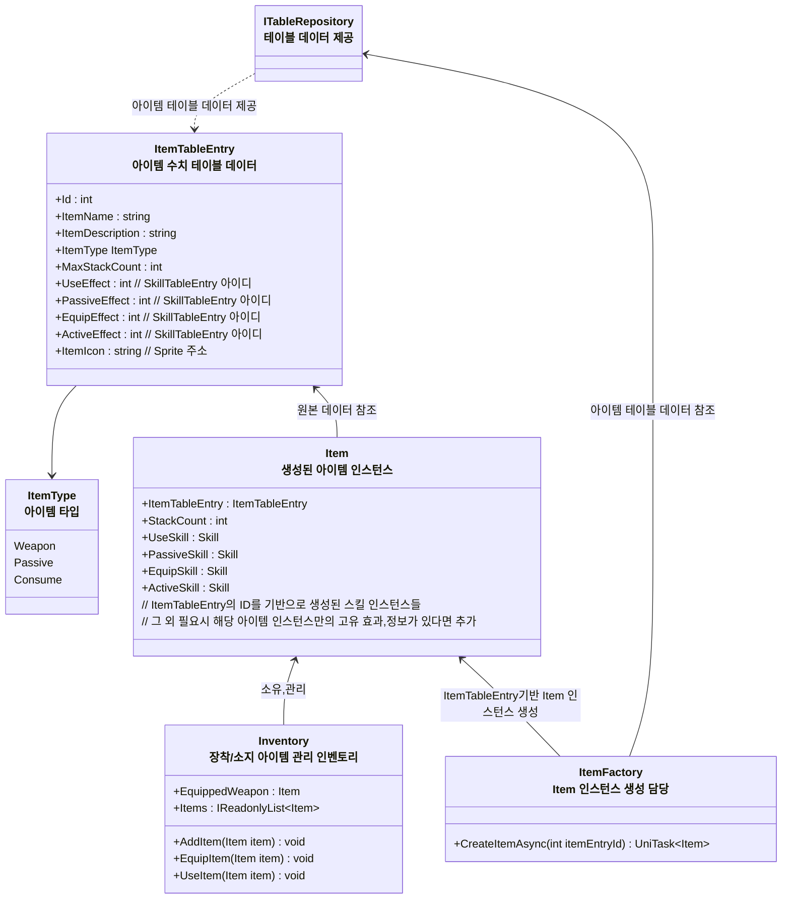
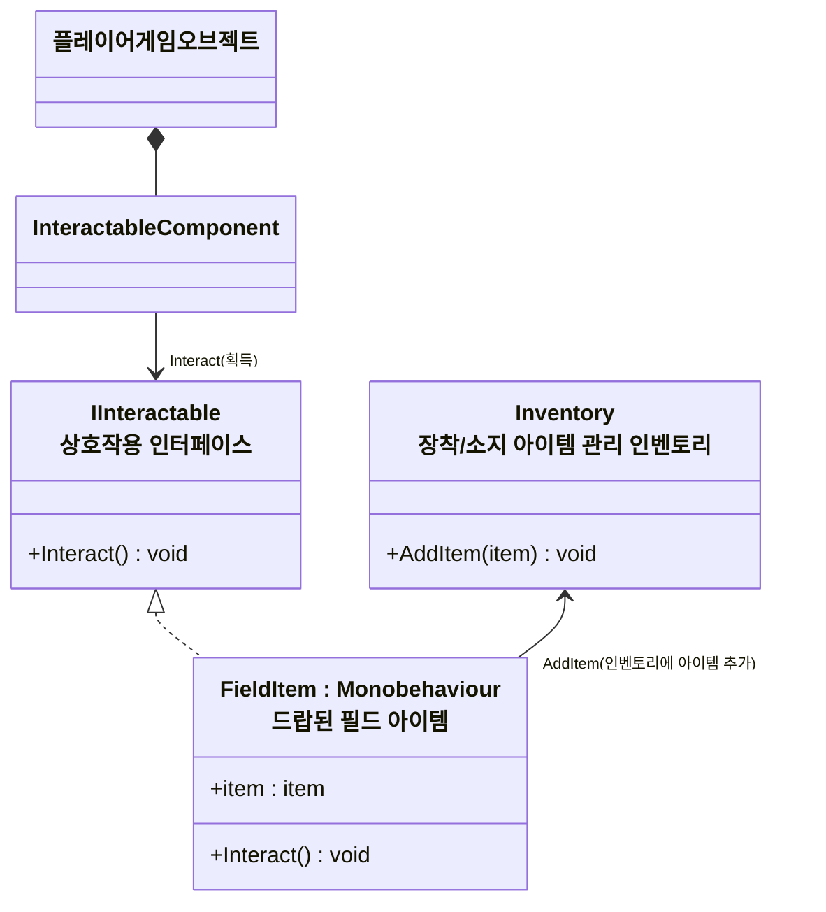

# 개요
> 아이템과 인벤토리 시스템 전반에 대한 설계 문서입니다

# 아이템, 인벤토리 기능
* 인벤토리 스펙
    * 장착 아이템 슬롯
        * 1개의 무기 슬롯
	        * 스텟 데이터
            * 무기 공격 스킬
				* 예시 - 장창, 일반 공격 스킬 - 찌르기
    * 인벤토리 영역
        * 아이템들이 저장되는 공간
        * 액티브 아이템, 무기, 소비 아이템이 저장된다
* 아이템들의 고유 특징
    * 무기
	    * 무기 슬롯에 장착 가능
	        * 해제하기 위해서는 다른 무기를 장착해야 한다
		* 공격버튼, 필살기 버튼을 눌러 공격할 수 있다
    * 패시브
        * 소지하면 지속적으로 효과가 부여된다
	* 소비
		* 인벤토리에서 사용하면 효과가 실행된다

# 다이어그램

### 인벤토리와 아이템 인스턴스 관계도

* `ITableRepository` :  테이블 데이터 리포지토리
	* CSV,DB 등 어떤 방식으로 제공할지는 구체 클래스에서 구현
* `ItemTableEntry` : 아이템 정보, 수치 데이터가 포함된 데이터
    * UseEffect : 소모 아이템 사용 효과
    * PassiveEffect : 아이템 소지 효과
    * EquipEffect : 무기 아이템 장착 효과
    * ActiveEffect : 무기 아이템 사용 효과
* `Item` : 개별 아이템 '객체'
	* 스택 갯수 등 특정 아이템의 고유 정보 포함
    * 아이템 인스턴스 생성시 `ItemTableEntry`의 데이터 기반으로 스킬 인스턴스 생성
      * UseSkill : 소모 아이템 사용시 실행
      * PassiveSkill : 아이템이 인벤토리에 들어오면 효과 적용, 나가면 제거 
      * EquipSkill : 무기 아이템을 장착할때 효과 적용, 해제하면 제거
      * ActiveSkill : 무기 아이템을 사용할때 실행
* `Inventory` : 아이템 장착/소지 관리 인벤토리
  * 아이템,획득,제거,장착,해제시 스킬 활성화, 해제를 실행
  * 무기 장착, 아이템 사용시 아이템 타입에 따라 장착가능 여부를 판단 (ItemType이 Weapon일 때 장착가능)
  * `Inventory`는 캐릭터 게임오브젝트에 귀속되어야 하는 정보가 아니므로 `EntityComponent`로 사용하지 않음, (플레이어블 캐릭터가 교체되거나 해도 인벤토리는 유지)
  * 스테이지 씬에 진입시 `StageLifeTimeScope`에서 `Scoped` 형태로 생성한 후 주입해 사용하고 스테이지 씬에서 벗어날 경우 해제

### 필드 아이템 (드롭 아이템) 상호작용 구조

