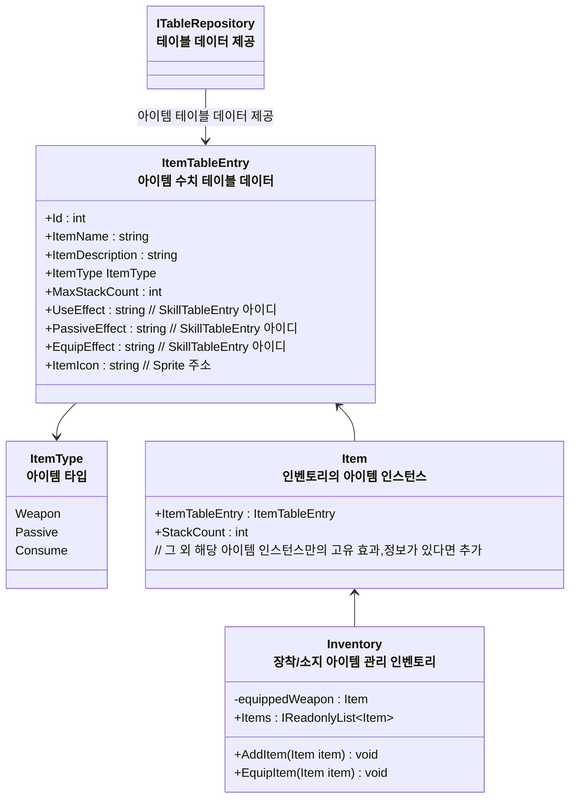

# 개요
> 아이템과 인벤토리 시스템 전반에 대한 설계 문서입니다

# 아이템, 인벤토리 기능
* 인벤토리 스펙
    * 장착 아이템 슬롯
        * 1개의 무기 슬롯
	        * 스텟 데이터
            * 무기 공격 스킬
				* 예시 - 장창, 일반 공격 스킬 - 찌르기
    * 인벤토리 영역
        * 아이템들이 저장되는 공간
        * 액티브 아이템, 무기, 소비 아이템이 저장된다
* 아이템들의 고유 특징
    * 무기
	    * 무기 슬롯에 장착 가능
	        * 해제하기 위해서는 다른 무기를 장착해야 한다
		* 공격버튼, 필살기 버튼을 눌러 공격할 수 있다
    * 패시브
        * 소지하면 지속적으로 효과가 부여된다
	* 소비
		* 인벤토리에서 사용하면 효과가 실행된다

# 다이어그램

### 인벤토리와 아이템 인스턴스 관계도

* `ITableRepository` :  테이블 데이터 리포지토리
	* CSV,DB 등 어떤 방식으로 제공할지는 구체 클래스에서 구현
* `ItemTableEntry` : 아이템 정보, 수치 데이터가 포함된 데이터
* `Item` : 개별 아이템 '객체'
	* 스택 갯수 등 특정 아이템의 고유 정보 포함
* `Inventory` : 아이템 장착/소지 관리 인벤토리
	* 무기 장착시 무기 타입에 따라 장착가능 여부를 판단 (Weapon일 때)
	* `Inventory`는 캐릭터 게임오브젝트에 귀속되어야 하는 정보가 아니므로 `EntityComponent`로 사용하지 않음, (플레이어블 캐릭터가 교체되거나 해도 인벤토리는 유지)
	* 스테이지 씬에 진입시 `StageLifeTimeScope`에서 `Scoped` 형태로 생성한 후 주입해 사용하고 스테이지 씬에서 벗어날 경우 해제

### 필드 아이템 (드롭 아이템) 상호작용 구조

# 임시 작성

### 아이템 구조 변경 구상
* ItemTableEntry를 중심으로 하는 구조로 변경
* 아이템 데이터는 ItemTableEntry 참고
* ItemTableEntry
	* 아이템 타입 : Equip Consume, Weapon
	* 스택 카운트 : int
	* 사용 효과 : string, SkillTableEntry ID
	* 소지 효과 : string, SkillTableEntry ID
	* 장착 효과 : string, SkillTableEntry ID
	* 아이템 데이터 string, ItemData Address
* ItemData
	* 아이템 이름 : string
	* 아이템 설명 : string

