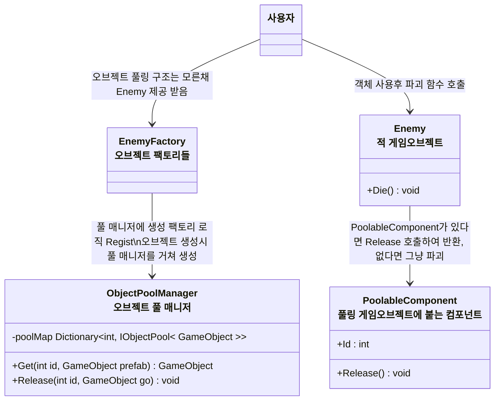

# 개요
> 게임오브젝트 오브젝트 풀링에 대한 설계 문서입니다.

- 각 오브젝트 팩토리들 (EnemyFactory등)이 풀과의 통신을 담당, 각 오브젝트의 사용자들은 크게 오브젝트 풀의 존재를 신경 쓸 필요 없게 하기
---

# 설계

- `ObjectPoolManager`
    - Table ID:ObjectPool 형식으로 풀을 관리한다
        - 예: Skill 14000101 : ObjectPool
        - 스킬 14000101 게임오브젝트 인스턴스에 대한 Pool
    - `Get<GameObject>(int id, GameObject prefab)`
        - 만약 새로운 객체를 생성해야한다면 넘긴 프리팹을 통해 생성
        - 풀 안에 있다면 풀 안의 객체 반환
    - `Release(int id, GameObject go)`
      - 풀 안에 반환
- `PoolableComponent` : 풀링 오브젝트에 붙는 컴포넌트
    - int Id // 오브젝트 풀 Id
    - void Release() : 풀에 반환