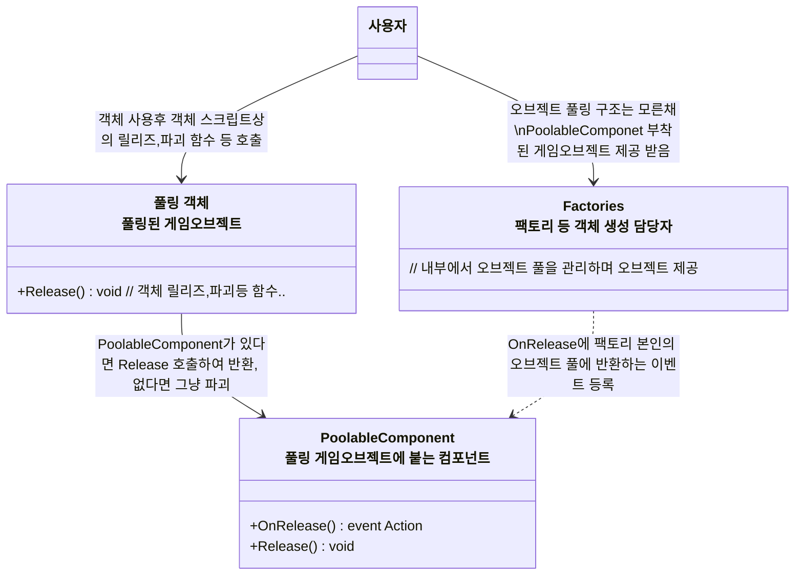

# 개요
> 게임오브젝트 오브젝트 풀링에 대한 설게 문서입니다.

---

## 공통구조

```mermaid
classDiagram
    class Factories["Factories<br>팩토리 등 객체 생성 담당자"]{
        // 내부에서 오브젝트 풀을 관리하며 오브젝트 제공
    }
    
    class PoolableComponent["PoolableComponent<br>풀링 게임오브젝트에 붙는 컴포넌트"]{
        +OnRelease() event Action
        +Release() void
    }
    
    class 풀링객체["풀링 객체<br>풀링된 게임오브젝트"]{
        +Release() void // 객체 릴리즈,파괴등 함수.. 
    }
    
    사용자 --> Factories : 오브젝트 풀링 구조는 모른채\nPoolableComponet 부착된 게임오브젝트 제공 받음
    사용자 --> 풀링객체 : 객체 사용후 객체 스크립트상의 릴리즈,파괴 함수 등 호출

    풀링객체 --> PoolableComponent : PoolableComponent가 있다면 Release 호출하여 반환, 없다면 그냥 파괴
    Factories ..> PoolableComponent : OnRelease에 팩토리 본인의 오브젝트 풀에 반환하는 이벤트 등록
```
- 각 오브젝트 팩토리들 (EnemyFactory등)이 오브젝트 풀과의 통신 담당
- 각 오브젝트의 사용자들은 오브젝트 풀의 존재를 신경 쓸 필요 없음