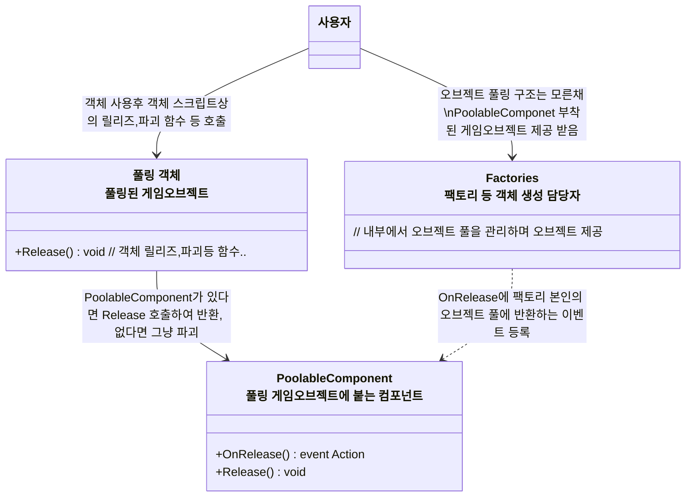

# 개요
> 게임오브젝트 오브젝트 풀링에 대한 구상 문서입니다, 현재 구현은 되지 않았습니다.

---

## 공통구조

- 각 오브젝트 팩토리들 (EnemyFactory등)이 풀과의 통신을 담당
- 각 오브젝트의 사용자들은 오브젝트 풀의 존재를 신경 쓸 필요 없음

## 스킬 오브젝트 풀링 구조에 대한 생각..
> 대부분의 경우 테이블 ID당 대응되는 게임오브젝트가 하나인 경우가 많아 팩토리에서 풀을 관리하면 됨, 근데 스킬의 경우 ID 하나에 여러 게임오브젝트가 포함될 수 있는지가 모두 천차만별이므로 어떻게 풀링을 할지에 대한 고민 필요
- 두가지 방법이 있을 것 같음 
1. SkillData의 `SpawnProjectileEffect`등 소유한 하위 이펙트 자체가 고유의 오브젝트 풀을 갖도록 설계
   - 예를들면 파이어볼 투척 이펙트라면 파이어볼 투사체 파티클 게임오브젝트에 투사체 컴포넌트를 붙인 오브젝트를 내부 풀에 담음.
   - 스킬 효과의 구성이 같은 모든 스킬들이 하나의 SkillData를 공유하므로 다 같이 공유하므로 내부의 이펙트 클래스도 하나만 돌려씀
   - 따라서 파이어볼 LV1, 파이어볼 LV2.. 같은 스킬들이 풀 공유 가능
   - 장점 : 가장 변경이 적은 방법으로 보임
   - 단점 : 같은 파티클 이펙트를 쓰더라도 다른 스킬이라면 다른 풀을 쓰게 됨, 최적화 효과가 적음
2. 파티클 이펙트 풀을 만들기
   - 투사체인지, 장판스킬인지.. 등등 스킬 시전 관련 컴포넌트가 없는 순수 파티클 이펙트 게임오브젝트에 대한 풀을 만들기
   - 장점 : 같은 이펙트라면 같은 풀을 쓸 수 있음
   - 단점 : 오브젝트 풀을 쓰면서 매번 컴포넌트를 제거하고 추가하는 것 자체가 어불성설이라 지금처럼 파티클 오브젝트에 자체에 투사체 컴포넌트를 붙이는 구조가 불가능할 것으로 판단됨, 따라서 스킬 오브젝트 구조의 개선이 필요함, 구조에 대한 고민이 필요
