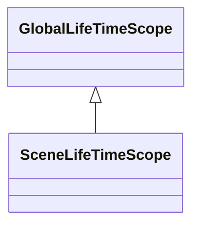
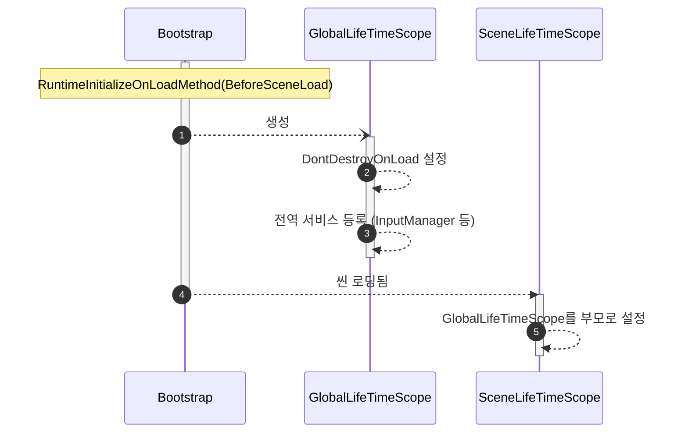

## 개요
> VContainer 패키지를 사용한 의존성 관리의 기본 구조에 대한 설계 문서입니다.

## 다이어그램

## LifeTimeScope 계층구조

* `GlobalLifeTimeScope`
  * 씬에 종속되지 않는 전역적인 의존성, 여기서 등록된 싱글턴 객체들은 게임 내내 유지
* `SceneLifeTimeScope`
  * 특정 씬에 종속적인 의존성, 여기서 등록한 객체들은 씬을 벗어나면 소멸됨

## 게임 실행시 초기화 시퀀스

* 모든 씬이 완전히 로드되기 전 필요한 전처리 작업(`GlobalLifeTimeScope`의 초기화 포함)은 `Bootstrap` 클래스에서 담당한다
* 전역적인 의존성은 `GlobalLifeTimeScope` 클래스가 담당한다
  