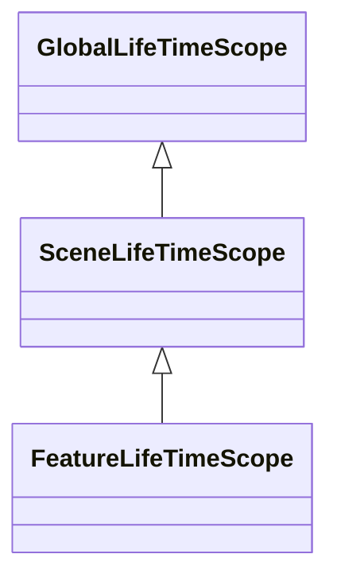

## 개요
> VContainer 패키지를 사용한 의존성 관리의 기본 구조에 대한 설계 문서입니다.

- 왜 VContainer를 선택했나?
  - Zenject 대비 더 가볍고 많이 쓰이는 프레임워크
  - https://jin5eok.netlify.app/02.DevWiki/Sources/%EC%9C%A0%EB%8B%88%ED%8B%B0%20%EC%9D%98%EC%A1%B4%EC%84%B1%20%EC%A3%BC%EC%9E%85%20-%20VContainer%20,%20Zenject,%20Extenject/ 참고

## 다이어그램

## LifeTimeScope 계층구조

- `GlobalLifeTimeScope`
  - 씬에 종속되지 않는 전역적인 의존성, 여기서 등록된 싱글턴 객체들은 게임 내내 유지됨, 게임 내내 유지되어야 하는 의존성을 여기서 관리
- `SceneLifeTimeScope`
  - 특정 씬에 종속적인 의존성, 여기서 등록한 객체들은 씬에 진입하면 자동 생성되고 씬을 벗어나면 소멸되어 사용자가 생명주기 관리를 신경쓸 필요 없도록 함
- `FeatureLifeTimeScope`
  - 특정 기능에 종속적인 의존성, 예를들면 캐릭터에 대한 의존성들을 정의한 `EntityLifeTimeScope`