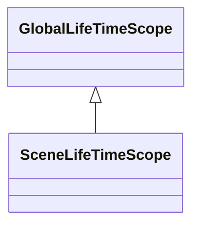
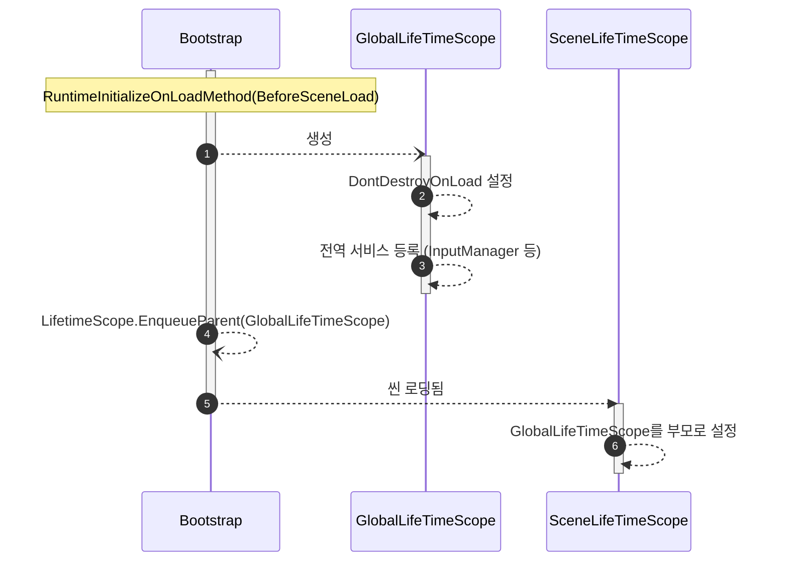
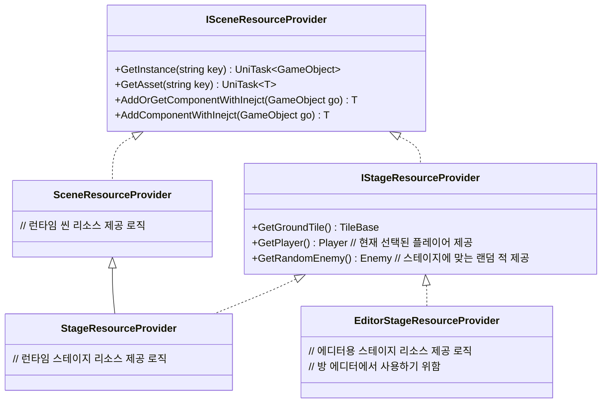

## 구상
* 모든 씬이 완전히 로드되기 전 전처리 작업은 `Bootstrap` 클래스에서 담당한다
	* `RuntimeInitializeOnLoadMethod(BeforeSceneLoad)`를 사용하여 어떤씬에서 시작해도 초기화 로직을 실행하도록 한다
* 전역적인 의존성은 `GlobalLifeTimeScope` 클래스가 담당한다
	* 이때 `Bootstrap`에서 GlobalLifeTimeScope의 초기화를 처리한다

## 다이어그램

### LifeTimeScope 계층

* `GlobalLifeTimeScope`: 씬에 종속되지 않는 전역적인 의존성
* `SceneLifeTimeScope`: 특정 씬에 종속적인 의존성

### 게임 실행시 초기화 시퀀스

### SceneResourceProvider : 씬에 필요한 리소스 제공, 상속 구조 예시

- `SceneResourceProvider`의 기본 역할
	- 리소스 제공
	- 씬 이동시 로드된 리소스 해제
    - 에셋 로드, 오브젝트 생성, 컴포넌트 추가시 의존성 주입
    - 씬마다 추가적으로 필요한 메서드가 있다면 상속을 통해 추가
- 기본적으론 리소스 불러오기를 위해 내부적으로 어드레서블을 사용
	- 하지만 어드레서블을 사용하지 않는 리소스 프로바이더 추가를 염두에 두기 위해 어드레서블 핸들 대신 `UniTask<T>` 반환
- 기본적으로 모든 리소스를 여기서 제공, 복잡도가 늘어나 분리가 필요하다고 판단되면 별도의 팩토리, 리포지토리등으로 분리
	- 단 이때도 별도의 리소스 생명주기 관리가 필요한게 아니라면 `ResourceProvider`들에 의존하도록 만들기