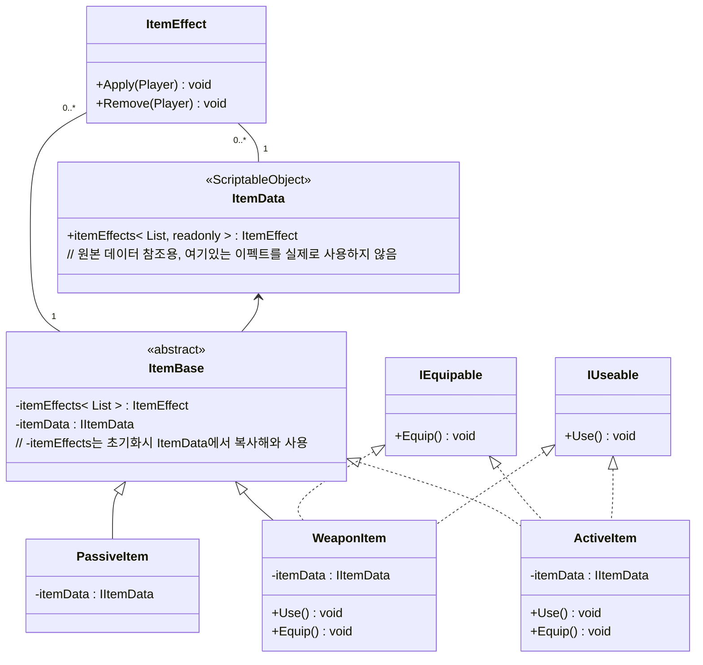

### 스펙 구상
* 인벤토리 스펙
    * 장착 아이템 슬롯
        * 1개의 무기 슬롯
            * 무기에는 고유 능력이 하나 존재한다, 필살기 느낌
            * 예시 - 장창, 고유 능력 - 돌진공격
        * 1개의 액티브 아이템 슬롯
            * 예시 - 파이어볼 마법서 : 파이어볼을 발사할 수 있다
    * 인벤토리 영역
        * 아이템들이 저장되는 공간
        * 액티브 아이템, 무기, 패시브 아이템이 저장된다
* 아이템들의 고유 특징
    * 무기
        * 장착하면 해제할 수 없다, 해제하기 위해서는 다른 무기를 장착하는 수 밖에 없다
    * 액티브
        * 무기와 비슷하게 장착하면 해제할 수 없다, 해제하기 위해서는 다른 무기를 장착해야 한다
        * 게임 중 사용버튼을 눌러 사용할 수 있다
    * 패시브
        * 소지하면 지속적으로 효과가 부여된다
* 내부 자료구조
    * 인벤토리
        * 자료구조
            * 통합 아이템 인벤토리 공간(리스트)
            * 일단은 리스트 사용하되 추후 색인 필요할 경우 딕셔너리 등 다른 방식 모색
        * 함수
            * 아이템 추가/삭제

## 다이어그램

### 인벤토리

### 인벤토리 아이템

### 필드 아이템 (드롭 아이템)

# 임시 작성
* Item은 스크립터블 오브젝트로 작성한다
* `PassiveItem`
- `WeaponItem`에는 액티브 스킬이 두개 붙도록 한다 (스크립터블 오브젝트로 지정)
	- 일반 공격
	- 필살기
* 스킬 이펙트 구현방식
	* 액티브와 패시브 둘다 EffectBase로 효과 구성
	* 스킬컴포넌트에 패시브 스킬 기능도 추가
		* 장착시 스킬 컴포넌트에 스킬 등록, 해제시 스킬 컴포넌트에서 스킬 해제
	* Skill을 PassiveSkill, ActiveSkill로 분리 