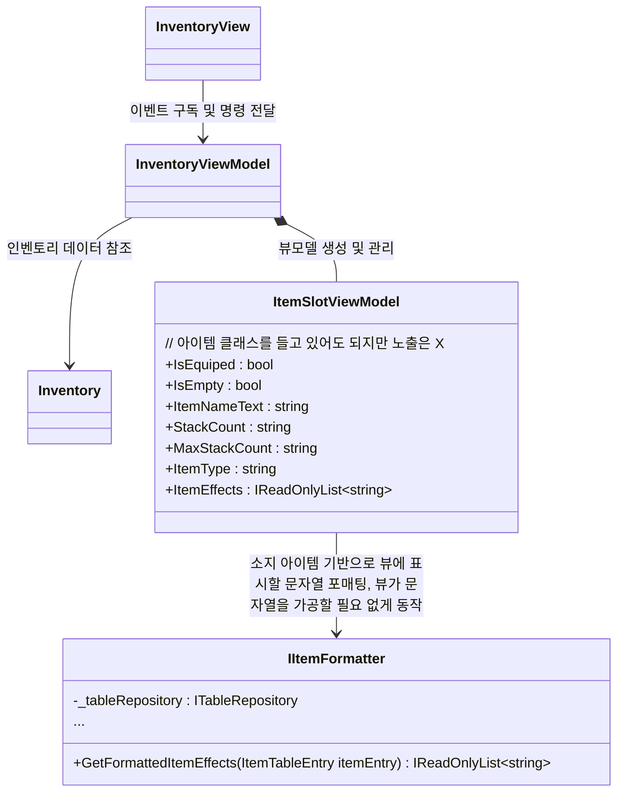

- 문제 정의
  - `InventoryView`가 `IPauseManager`를 사용하고 있음 (View의 권한 과다)
    - 해결 : `InventoryView`의 `IPauseManager`호출을 `InventoryViewModel`로 옮긴다
  - 아이템이 추가되거나 제거될때 인벤토리 슬롯을 매번 추가하거나 제거하면서 성능 문제는 둘째치고 로직이 복잡함
    - 해결 : 슬롯을 미리 다 생성해두는 구조로 변경 (단 10칸 제한)
      - 수많은 OnSlotAdd, OnSlotRemoved.. 이런 수많은 콜백들을 OnSlotChanged 하나로 통합
  - `ItemSlotViewModel`에서 `InventoryView`에게 너무 '구체적'인 데이터를 제공함
    - 해결 : Table데이터 등 제외하고 string, 스프라이트 등 로직과 완전히 분리된 정보만 제공하도록 변경  
    - `ITableRepository`를 `InventoryView`에서 참조 제거
    - `IItemFormatter` 추가, 필요한 View용 표시 문자열 포매팅을 여기서 담당하도록 변경

