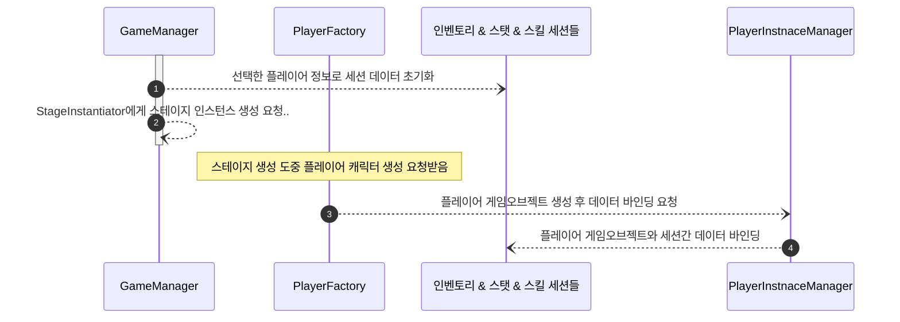

# 임시작성중...

# 개요
> 플레이어 게임오브젝트 관리 방식에 대한 설계 문서입니다
> 
# 플레이어 게임 오브젝트 관리
- 플레이어 캐릭터와 스탯,스킬,인벤토리 같은 정보는 별도의 세션으로 관리하고 게임오브젝트 생성시 바인딩 하는 방식으로 다뤄야 한다
- 플레이어 관련 데이터가 플레이어 게임오브젝트에 종속되면 게임이 완전히 끝날 때 까지 플레이어 게임오브젝트를 파괴시키거나 다른 게임오브젝트로 교체하는게 불가능해지기 때문

### 게임 시작시 플레이어 게임오브젝트 초기화 시퀀스

1. `GameManager`가 스테이지를 초기화 할때 먼저 플레이어가 선택한 정보를 기반으로 각 세션 데이터들을 초기화 한다.
2. 이후 `PlayerFactory`가 플레이어 게임오브젝트를 생성하고 `PlayerInstanceManager`에게 전달해 세션과 플레이어 게임오브젝트를 바인딩한다.
3. 이 세션 데이터들은 게임이 끝날 때 까지(스테이지 씬에서 나갈 때 까지) 플레이어 게임오브젝트가 파괴되더라도 유지된다

- `PlayerInstanceManager` : 플레이어 게임오브젝트와 세션, UI간의 연동 담당
- 세션역할을 수행하는 클래스들, 플레이어 게임오브젝트에 종속되지 않으며 사용할 플레이어 게임오브젝트를 바인딩할 수 있음
  - `PlayerStatusSession` : 플레이어 스탯 담당
  - `PlayerSkillSession` : 플레이어 스킬 담당
  - `Inventory` : 아이템 인벤토리 담당
  - `PlayerInputSession` : 플레이어 캐릭터와 키 입력 이벤트 담당