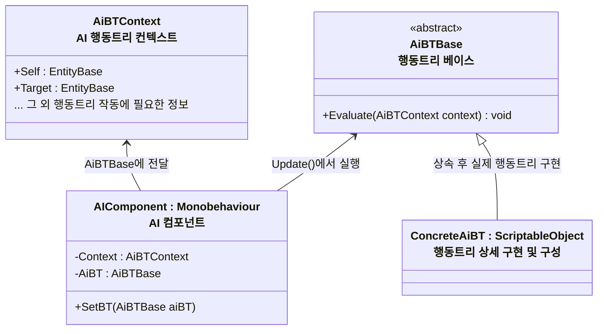

# 개요
> 몬스터 AI를 위한 행동트리의 구조 설계입니다

# 설계

 

- `AiBTContext`
- `AiBTBase`
    - 행동 AI 행동트리 베이스 클래스
- `ConcreteAiBT`
    - 에디터에서 스크립터블 오브젝트를 생성해 스크립터블 오브젝트의 필드로 수치 편집 가능
        - 예: 적 감지 거리
- `AIComponent`
  - `EntityComponent`의 일종